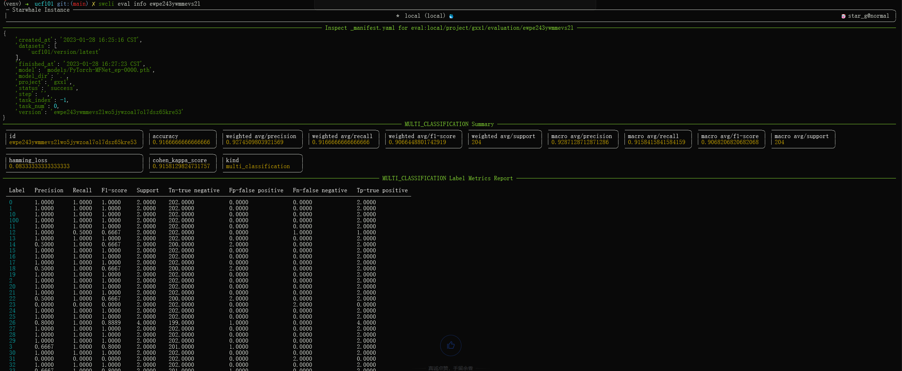

From this example, we can learn the following skills:

- Use the type of Video to build dataset.
- Use `starwhale.Evaluation` SDK.

## Prerequisites

- Python3.7 +.
- Starwhale Client.
  - install: `pip install starwhale`
  - check version: `swcli --version`
- Clone starwhale repo `git clone --depth=1 https://github.com/star-whale/starwhale.git`

## Preparing Data

- Enter the director `example/ucf101`

- Download data and preTrained model file

```shell
cd starwhale/example/ucf101
make prepare
```

## Build Runtime With Starwhale

```shell
swcli runtime build .
swcli runtime info ucf101/version/latest
```

## Build Dataset With Starwhale

```bash
swcli dataset build .
swcli dataset info ucf101/version/latest
```

## Debug And Build Model With Starwhale

- Debug the Model at the step of preBuild

```bash
swcli runtime activate --uri ucf101/version/latest
swcli model eval . --dataset ucf101/version/latest
swcli model info ${version}
```

- There are the code with Starwhale Python SDK. Full code is [here](https://github.com/star-whale/starwhale/blob/main/example/ucf101/ucf101/evaluator.py).

```python
@multi_classification(
        confusion_matrix_normalize="all",
        show_hamming_loss=True,
        show_cohen_kappa_score=True,
        show_roc_auc=True,
    )
def cmp(self, ppl_result: PPLResultIterator) -> t.Any:
    result, label, pr = [], [], []
    for _data in ppl_result:
        label.append(_data["annotations"]["label"])
        result.append(_data["result"][0])
        pr.append(_data["result"][1])
    return label, result, pr
```

- View evaluation results on Standalone Instance



- Write Model.yaml

```yaml
name: ucf101

run:
  handler: ucf101.evaluator:UCF101PipelineHandler

desc: ucf101 by pytorch
```

- Build Model With Starwhale

```shell
swcli model build .
swcli model info ucf101/version/latest
```

## Run Evaluation Job on Cloud Instance

To run the evaluation job on the Cloud Instance, we need to publish the Model, Dataset and Runtime built on the Standalone Instance to the corresponding Instance.

```shell
# login the corresponding Instance，then we can use 'prod' alias to access this instance
swcli instance login --username ${username} --token ${token}  http://${instance-address} --alias prod
# select current instance to local
swcli instance select local
# upload the model to the project named starwhale in the prod instance
swcli model copy ucf101/version/latest cloud://prod/project/starwhale
# upload the dataset to the project named starwhale in the prod instance
swcli dataset copy ucf101/version/latest cloud://prod/project/starwhale
# upload the runtime to the project named starwhale in the prod instance
swcli runtime copy ucf101/version/latest cloud://prod/project/starwhale
```

Then, execute the `swcli ui prod` command in the terminal, we can pull up the browser and enter the web page of the prod instance, then enter the 'starwhale' project, and create an evaluation job.

## References

- [PyTorch-MFNet](https://github.com/cypw/PyTorch-MFNet)
- [Dataset of UCF-101](https://www.crcv.ucf.edu/data/UCF101.php)
