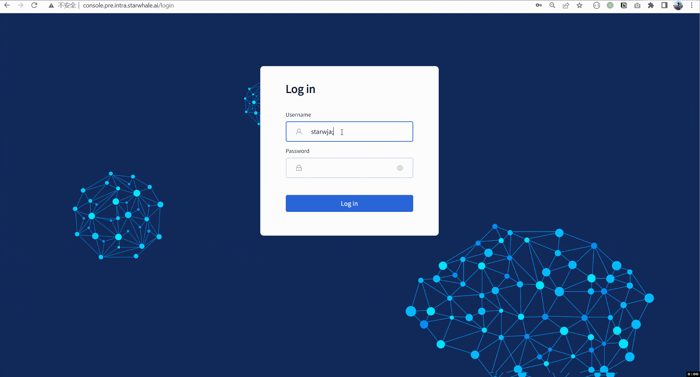
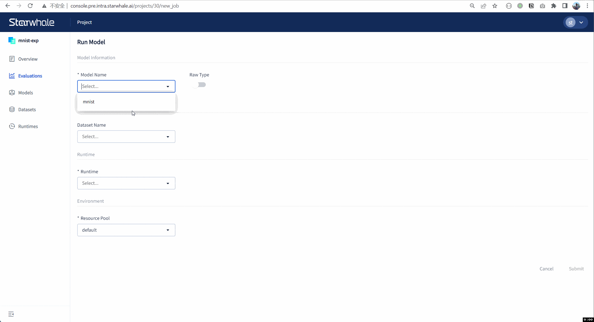

:::tip
It is recommended to read [standalone quickstart](../standalone/getting_started.md) first.
:::

## 1. Installing On-Premises

Starwhale provides two ways to install an On-Premises instance in your private cluster:

- For Kubernetes:

  - Standard Kubernetes Cluster: A pre-deployed Kubernetes cluster is required.
  - Minikube: You should have minikube and docker installed on your machine.
  - For more deployment details of Kubernetes, you can refer to this [doc](install/helm-charts.md).

:::notes
In this tutorial, minikube is used instead of the standard Kubernetes cluster
:::

### 1.1 Prerequisites

- [Minikube](https://minikube.sigs.k8s.io/docs/start/) 1.25+
- [Helm](https://helm.sh/docs/intro/install/) 3.2.0+

### 1.2 Start Minikube

```bash
minikube start
```

For users in the mainland of China, please add some external parameters. The following command was well tested; you may also try another kubernetes version.

```bash
minikube start --image-mirror-country=cn --kubernetes-version=1.25.3
```

If there is no kubectl bin in your machine, you may use `minikube kubectl` or `alias kubectl="minikube kubectl --"` alias command.

### 1.3 Installing Starwhale

```bash
helm repo add starwhale https://star-whale.github.io/charts
helm repo update
helm pull starwhale/starwhale --untar --untardir ./charts

helm upgrade --install starwhale ./charts/starwhale -n starwhale --create-namespace -f ./charts/starwhale/values.minikube.global.yaml
```

For users in the mainland of China, please use the following upgrade command:

```bash
helm upgrade --install starwhale ./charts/starwhale -n starwhale --create-namespace -f ./charts/starwhale/values.minikube.cn.yaml
```

After the installation is successful, the following prompt message appears:

```bash
Release "starwhale" has been upgraded. Happy Helming!
NAME: starwhale
LAST DEPLOYED: Tue Feb 14 16:25:03 2023
NAMESPACE: starwhale
STATUS: deployed
REVISION: 14
NOTES:
******************************************
Chart Name: starwhale
Chart Version: 0.1.0
App Version: latest
Starwhale Image:
    - server: ghcr.io/star-whale/server:latest
Runtime default Image:
  - runtime image: ghcr.io/star-whale/starwhale:latest

******************************************
Web Visit:

Port Forward Visit:
  - starwhale controller:
    - run: kubectl port-forward --namespace starwhale svc/controller 8082:8082
    - visit: http://localhost:8082
  - minio admin:
    - run: kubectl port-forward --namespace starwhale svc/minio 9001:9001
    - visit: http://localhost:9001
  - mysql:
    - run: kubectl port-forward --namespace starwhale svc/mysql 3306:3306
    - visit: mysql -h 127.0.0.1 -P 3306 -ustarwhale -pstarwhale

******************************************
Login Info:
- starwhale: u:starwhale, p:abcd1234
- minio admin: u:minioadmin, p:minioadmin

*_* Enjoy to use Starwhale Platform. *_*
```

Then keep checking the minikube service status until all deployments are running.

```bash
kubectl get deployments -n starwhale
```

| NAME | READY | UP-TO-DATE| AVAILABLE | AGE |
|------|-------|--------|----------|-----|
|controller|1/1|1|1|5m|
|minio|1/1|1|1|5m|
|mysql|1/1|1|1|5m|

Make the Starwhale controller accessible locally with the following command:

```bash
kubectl port-forward --namespace starwhale svc/controller 8082:8082
```

When the controller's pod is restarted, the port-forward command needs to be re-executed.

## 2. Upload the artifacts to the cloud instance

Before starting this tutorial, the following three artifacts should already exist on your machine：

- a starwhale model named mnist
- a starwhale dataset named mnist
- a starwhale runtime named pytorch

The above three artifacts are what we built in the [standalone tutorial](../standalone/getting_started.md).

### 2.1 Login Cloud Instance

First, log in to the server:

```bash
swcli instance login --username starwhale --password abcd1234 --alias dev http://localhost:8082
```

### 2.2 Release artifacts

Start copying the model, dataset, and runtime that we constructed earlier:

```bash
swcli model copy mnist/version/latest dev/project/starwhale
swcli dataset copy mnist/version/latest dev/project/starwhale
swcli runtime copy pytorch/version/latest dev/project/starwhale
```

## 3. Use the web UI to run an evaluation

### 3.1 Viewing Cloud Instance

Ok, let's use the username(starwhale) and password(abcd1234) to open the server [web UI](http://localhost:8082/).



### 3.2 Create an evaluation job



**Congratulations! You have completed the evaluation process for a model.**
