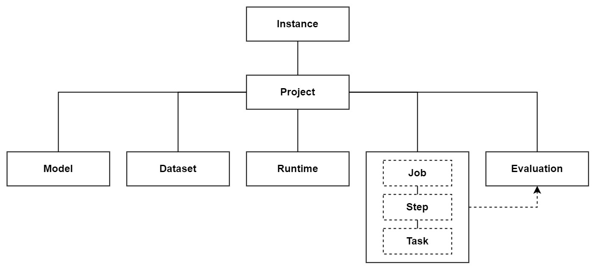

:::tip
**Resource URI is widely used in Starwhale client commands. The URI can refer to a resource in the local instance or any other resource in a remote instance. In this way, the Starwhale client can easily manipulate any resource.**
:::



## 1. Instance URI

Instance URI can be either:

- `local`: standalone instance.
- `[http(s)://]<hostname or ip>[:<port>]`: cloud instance with HTTP address.
- `[cloud://]<cloud alias>`: cloud instance with an alias name, which can be configured in the instance login phase.

:::caution
"local" is different from "localhost". The former means the local standalone instance without a controller, while the latter implies a controller listening at the default port 8082 on localhost.|
:::

Example:

```bash
# login http://console.pre.intra.starwhale.ai instance, the alias is pre-k8s
swcli instance login --username starwhale --password abcd1234 http://console.pre.intra.starwhale.ai --alias pre-k8s
# copy model from the local instance, default project into cloud instance, instance field uses the alias name: pre-k8s.
swcli model copy mnist/version/latest cloud://pre-k8s/project/1
# copy runtime into cloud instance: localhost:8081
swcli runtime copy pytorch/version/v1.0 http://localhost:8081/project/myproject
```

## 2. Project URI

Project URI is in the format `[<Instance URI>/project/]<project name>`. If the instance URI is not specified, use the default instance instead.

Example:

```bash
swcli project select self   # select self project in the current instance
swcli project info local/project/self  # inspect self project info in the local instance
```

## 3. Model/Dataset/Runtime URI

- Model URI: `[<Project URI>/model/]<model name>[/version/<version id|tag>]`.
- Dataset URI: `[<Project URI>/dataset/]<dataset name>[/version/<version id|tag>]`.
- Runtime URI: `[<Project URI>/runtime/]<runtime name>[/version/<version id|tag>]`.
- `swcli` supports short version which is at least five characters, but `recover` command must use full version.
- If the project URI is not specified, use the default project.
- The version id field also supports tag.

Example:

```bash
swcli model info mnist/version/hbtdenjxgm4ggnrtmftdgyjzm43tioi  # inspect model info, model name: mnist, version:hbtdenjxgm4ggnrtmftdgyjzm43tioi
swcli model remove mnist/version/hbtdenj  # short version
swcli model info mnist  # inspect mnist model info
swcli job create --model mnist/version/latest --runtime pytorch-mnist/version/latest --dataset mnist/version/latest
```

## 4. Evaluation URI

- format: `[<Project URI>/evaluation/]<job id>`.
- If the project URI is not specified, use the default project.

Example:

```bash
swcli eval info mezdayjzge3w   # Inspect mezdayjzge3w version in default instance and default project
swcli eval info local/project/self/job/mezday # Inspect the local instance, self project, with short job version:mezday
```

## 5. Names Limitation

Names mean project names, model names, dataset names, runtime names, and tag names.

- Names are case-insensitive.
- A name MUST only consist of letters `A-Z a-z`, digits `0-9`, the hyphen character `-`, the dot character `.`, and the underscore character `_`.
- A name should always start with a letter or the `_` character.
- The maximum length of a name is 80.

### 5.1 Names uniqueness requirement

The resource name should be a unique string within its owner. For example, the project name should be unique in the owner instance, and the model name should be unique in the owner project.

The resource name can not be used by any other resource of the same kind in the owner, including those removed ones. For example, Project "apple" can not have two models named "Alice", even if one of them is already removed.

Different kinds of resources can have the same name. For example, a project and a model can have the same name "Alice".

Resources with different owners can have the same name. For example, a model in project "Apple" and a model in project "Banana" can have the same name "Alice".

Garbage collected resources' names can be reused. For example, after the model with the name "Alice" in project "Apple" is removed and garbage collected, the project can have a new model with the same name "Alice".
