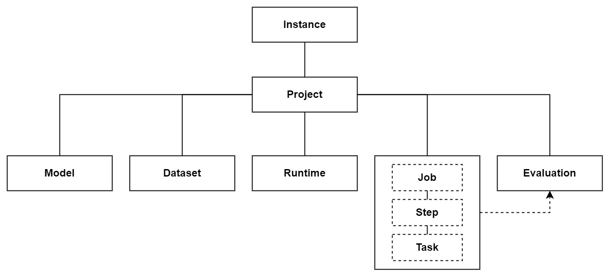

## 1. Instance

Each installation of Starwhale is called an instance, Cloud or Standalone:

- Standalone Instance
- Cloud Instance
  - On-Premises
  - Cloud Hosted

The standalone instance is the simplest form that requires only the Starwhale client (swcli). All data and metadata are stored locally on the client machine. All jobs and tasks are executed on the client machine as well. It is similar to git, which requires only a set of executable binaries.

The on-premises instance and hosted instance are both called cloud instances. We can call the on-premises instance "private cloud instance" and the hosted instance "public cloud instance". They both have a controller component and some optional agent components installed on one or more servers. The main difference is that on-premises instances are maintained by operation teams in different organizations, and hosted instances are maintained by the Starwhale team on the public cloud.

**Starwhale tries to keep concepts consistent across different types of instances. In this way, people can easily exchange data and migrate between instances.**

## 2. Project

Project is the basic unit for organizing different resources like models, datasets, etc.
Users may use projects for different purposes. For example, we can create a project for a data scientist team, a product line, or a specific model. Users usually work on one or more projects in their daily lives.
Every user in cloud instances has their personal project by default. Standalone instances also supports multi projects, `self` project will be created automatically and configured as the default project.

## 3. Model

Starwhale Model is the standard model format used in model delivery.

A Starwhale Model is a directory containing arbitrary files. It includes the model file generated by ML frameworks, the code file to run the model, the metadata file defined by Starwhale, and many other files.

A Starwhale Model can contain any information required to run the model, such as source codes, different model formats, etc. It can be stripped of redundant information to get a smaller package. The primary purpose of a stripped Starwhale Model Package is for delivery. Users may not want to show python inference code to the production team for security reasons or need a minimum deployable package on edge.

## 4. Runtime

Starwhale Runtime describes software dependencies to "run" a model. It includes python libraries, native libraries, native binaries, etc.

Stable software dependencies are essential for running a model. One reason is that installing dependencies is paining for most scientists. People spend days fighting with obscure error messages and finally become frustrated. Another reason is that deep learning natural networks are susceptible. A minuscule error in input may lead to a massive difference in output. Even different versions of a dependent library may impact model performance severely. Thus, it is essential to define the software runtime environment precisely.

Conda, Pip, and docker images are all solutions to define the software runtime environment. Starwhale Runtime supports all of them. Users can choose anyone they prefer.
Starwhale provides the ability to synchronize runtimes on different machines and to switch between runtimes. Build once, use anywhere.

## 5. Dataset

Starwhale organizes data into datasets.

Data usually have different storage formats and can be stored on distinct storage systems. Besides the original data, labels play a critical role in ML. Users usually label data from multiple perspectives and later use them in various models.

Starwhale dataset provides a unified description of how the data and labels are stored and organized. In this way, users can process data and labels quickly.

Starwhale Dataset is just a collection of arbitrary data. It is up to the user how to define a dataset.

## 6. Version

Starwhale manages the history of Model, Dataset, and Runtime. Every update appends a new version to the history.

Versions are identified by version id generated automatically by Starwhale and are ordered by creation time.

Starwhale uses a linear history model. There is neither branch nor cycle in history.

History can not be rollback. When a version is to be reverted, Starwhale copies the version and appends it to the end of the history. However, versions in the history can be manually removed and recovered.

## 7. Job, Step, and Task

A job is a set of programs to do specific work. A job consists of one or more steps, and each step consists of one or more tasks. Steps represent distinct stages of the work. They usually run with different codes. Tasks are replications of a step. Tasks in the same step always share the same program but run with separate data input.

Starwhale uses jobs to execute actions like model training, evaluation, and serving.

## 8. Evaluation

**Starwhale Evaluation** manages the entire lifecycle of model evaluation which includes create job, distribute tasks and generate report etc.
