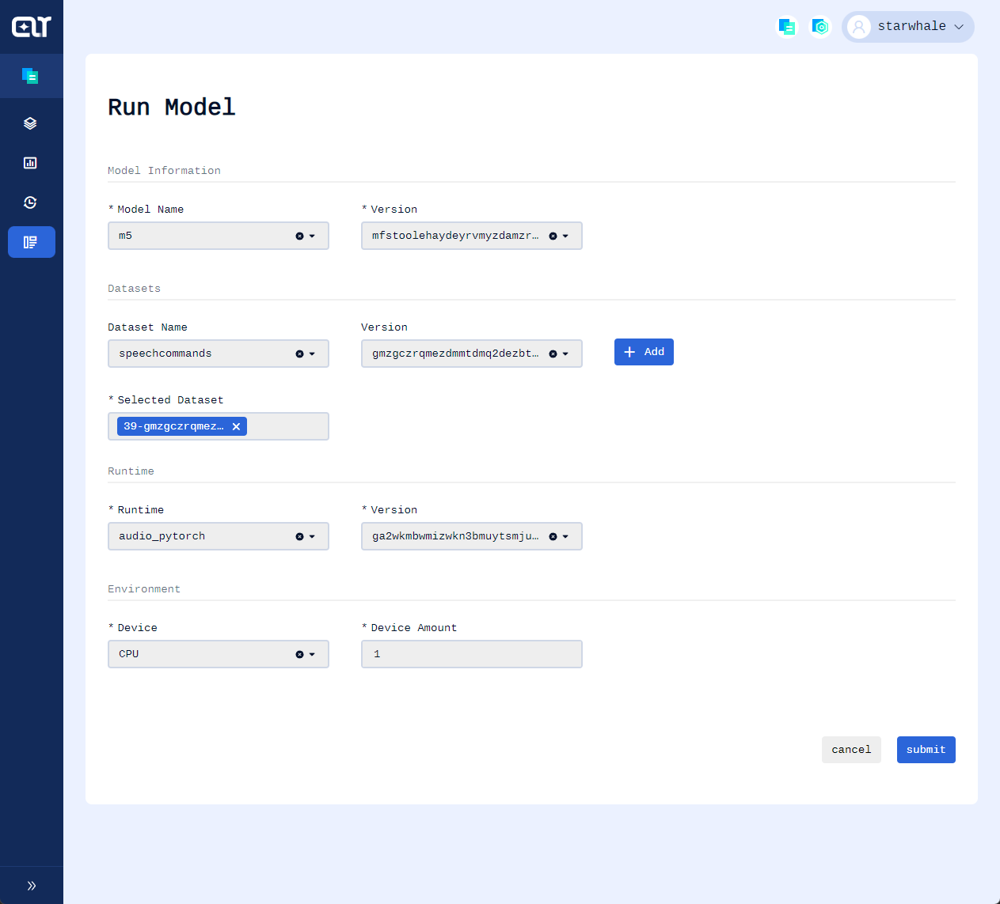

Example of object detection & segmentation model trained on PeenFudanPed dataset
-----------------
This example will illustrate how to evaluate a pre-trained image object detection & segmentation model on StarWhale(`version:0.2.0b8`) under 7 steps
* Install StarWhale globally
* Create a Runtime
* Train the model
* Implement the dataset slicing method
* Implement the inference method and evaluation metrics computing method
* Build SWDS & SWMP & SWRT
* Run the evaluation job and see the metrics

> :bulb: This example requires CUDA device

## Prerequisites
Assume that you have Python3.7 or above installed.

Clone starwhale repo
```shell
$ git clone https://github.com/star-whale/starwhale.git
$ cd starwhale/example/PennFudanPed
```
> :bulb: If you are from China mainland you're strongly recommended using a proxy

## Install StarWhale globally
```shell
$ pip install starwhale
Installing collected packages: attrs, joblib, scipy, threadpoolctl, scikit-learn, zipp, importlib-metadata, jsonlines, cattrs, requests-toolbelt, filelock, platformdirs, six, distlib, virtualenv, commonmark, pygments, rich, python-dateutil, jmespath, botocore, s3transfer, boto3, loguru, appdirs, fs, pyyaml, conda-pack, starwhale
WARNING: The script virtualenv is installed in '/home/starwhale/.local/bin' which is not on PATH.

$ pip list | grep starwhale
starwhale          0.2.0b8
$ swcli instance select local
```
If below warning tip shows, please add `~/.local/bin` to your `PATH`

```
WARNING: The script virtualenv is installed in '~/.local/bin' which is not on PATH.
```


## Create a Runtime
```shell
$ swcli runtime create . --name visual_pytorch -m venv --python=3.8 --force
🍒 /home/renyanda/.config/starwhale/config.yaml use unexpected version(None), swcli only support 2.0 version.
🥕 /home/renyanda/.config/starwhale/config.yaml will be upgraded to 2.0 automatically.
🚧 start to create runtime environment...
👏 create venv@/home/renyanda/penn_fudan_ped/venv, python:3.8.10 (default, Mar 15 2022, 12:22:08)
[GCC 9.4.0]
🐶 install starwhale==0.2.0b8 venv@/home/renyanda/penn_fudan_ped/venv...
🍰 run command in shell 🍰
        source /home/renyanda/penn_fudan_ped/venv/bin/activate
👏 python runtime environment is ready to use 🎉
$ source ./venv/bin/activate
(visual_pytorch) $  python3 -m pip install -r requirements.txt
```

> :bulb: make sure python3.8-venv is installed if you choose --python=3.8

> :bulb: `python3 -m pip install` is recommended over `pip install`


## Train the model
> The training code in this repo is sourced from https://pytorch.org/tutorials/intermediate/torchvision_tutorial.html However, some code is modified so that we could better understand how StarWhale works. 
```shell
(visual_pytorch) $ mkdir models
(visual_pytorch) $ mkdir data
(visual_pytorch) $ cd data
(visual_pytorch) $ wget https://www.cis.upenn.edu/~jshi/ped_html/PennFudanPed.zip
(visual_pytorch) $ unzip PennFudanPed.zip
(visual_pytorch) $ cd ../code
(visual_pytorch) $ python train.py
```
You will get the logs below:
```shell
Epoch: [0]  [ 0/60]  eta: 0:00:53  lr: 0.000090  loss: 4.0966 (4.0966)  loss_classifier: 0.6816 (0.6816)  loss_box_reg: 0.5010 (0.5010)  loss_mask: 2.8732 (2.8732)  loss_objectness: 0.0377 (0.0377)  loss_rpn_box_reg: 0.0030 (0.0030)  time: 0.8854  data: 0.2439  max mem: 2301
Epoch: [0]  [10/60]  eta: 0:00:26  lr: 0.000936  loss: 1.6386 (2.3167)  loss_classifier: 0.4771 (0.4451)  loss_box_reg: 0.2648 (0.3138)  loss_mask: 1.0382 (1.5171)  loss_objectness: 0.0333 (0.0361)  loss_rpn_box_reg: 0.0048 (0.0046)  time: 0.5398  data: 0.0271  max mem: 2854
Epoch: [0]  [20/60]  eta: 0:00:20  lr: 0.001783  loss: 1.0631 (1.5369)  loss_classifier: 0.1855 (0.3039)  loss_box_reg: 0.2486 (0.2801)  loss_mask: 0.4359 (0.9172)  loss_objectness: 0.0216 (0.0311)  loss_rpn_box_reg: 0.0036 (0.0047)  time: 0.4957  data: 0.0056  max mem: 2854
Epoch: [0]  [30/60]  eta: 0:00:15  lr: 0.002629  loss: 0.5589 (1.2301)  loss_classifier: 0.1008 (0.2355)  loss_box_reg: 0.2185 (0.2625)  loss_mask: 0.2284 (0.7025)  loss_objectness: 0.0093 (0.0237)  loss_rpn_box_reg: 0.0043 (0.0059)  time: 0.5067  data: 0.0059  max mem: 3040
Epoch: [0]  [40/60]  eta: 0:00:10  lr: 0.003476  loss: 0.5134 (1.0565)  loss_classifier: 0.0659 (0.1938)  loss_box_reg: 0.2171 (0.2535)  loss_mask: 0.2079 (0.5835)  loss_objectness: 0.0058 (0.0195)  loss_rpn_box_reg: 0.0069 (0.0063)  time: 0.5346  data: 0.0060  max mem: 3223
Epoch: [0]  [50/60]  eta: 0:00:05  lr: 0.004323  loss: 0.4611 (0.9360)  loss_classifier: 0.0526 (0.1657)  loss_box_reg: 0.1666 (0.2417)  loss_mask: 0.1795 (0.5055)  loss_objectness: 0.0044 (0.0166)  loss_rpn_box_reg: 0.0060 (0.0065)  time: 0.5374  data: 0.0062  max mem: 3226
Epoch: [0]  [59/60]  eta: 0:00:00  lr: 0.005000  loss: 0.4048 (0.8609)  loss_classifier: 0.0512 (0.1506)  loss_box_reg: 0.1666 (0.2323)  loss_mask: 0.1782 (0.4566)  loss_objectness: 0.0024 (0.0145)  loss_rpn_box_reg: 0.0069 (0.0070)  time: 0.5501  data: 0.0062  max mem: 3226
Epoch: [0] Total time: 0:00:31 (0.5324 s / it)
creating index...
index created!
Test:  [ 0/50]  eta: 0:00:17  model_time: 0.1715 (0.1715)  evaluator_time: 0.0043 (0.0043)  time: 0.3557  data: 0.1788  max mem: 3226
Test:  [49/50]  eta: 0:00:00  model_time: 0.1040 (0.1065)  evaluator_time: 0.0064 (0.0096)  time: 0.1234  data: 0.0030  max mem: 3226
Test: Total time: 0:00:06 (0.1251 s / it)
Averaged stats: model_time: 0.1040 (0.1065)  evaluator_time: 0.0064 (0.0096)
Accumulating evaluation results...
DONE (t=0.01s).
Accumulating evaluation results...
DONE (t=0.01s).
IoU metric: bbox
 Average Precision  (AP) @[ IoU=0.50:0.95 | area=   all | maxDets=100 ] = 0.658
 Average Precision  (AP) @[ IoU=0.50      | area=   all | maxDets=100 ] = 0.988
 Average Precision  (AP) @[ IoU=0.75      | area=   all | maxDets=100 ] = 0.746
 Average Precision  (AP) @[ IoU=0.50:0.95 | area= small | maxDets=100 ] = -1.000
 Average Precision  (AP) @[ IoU=0.50:0.95 | area=medium | maxDets=100 ] = 0.667
 Average Precision  (AP) @[ IoU=0.50:0.95 | area= large | maxDets=100 ] = 0.661
 Average Recall     (AR) @[ IoU=0.50:0.95 | area=   all | maxDets=  1 ] = 0.304
 Average Recall     (AR) @[ IoU=0.50:0.95 | area=   all | maxDets= 10 ] = 0.726
 Average Recall     (AR) @[ IoU=0.50:0.95 | area=   all | maxDets=100 ] = 0.729
 Average Recall     (AR) @[ IoU=0.50:0.95 | area= small | maxDets=100 ] = -1.000
 Average Recall     (AR) @[ IoU=0.50:0.95 | area=medium | maxDets=100 ] = 0.780
 Average Recall     (AR) @[ IoU=0.50:0.95 | area= large | maxDets=100 ] = 0.726
IoU metric: segm
 Average Precision  (AP) @[ IoU=0.50:0.95 | area=   all | maxDets=100 ] = 0.732
 Average Precision  (AP) @[ IoU=0.50      | area=   all | maxDets=100 ] = 0.990
 Average Precision  (AP) @[ IoU=0.75      | area=   all | maxDets=100 ] = 0.909
 Average Precision  (AP) @[ IoU=0.50:0.95 | area= small | maxDets=100 ] = -1.000
 Average Precision  (AP) @[ IoU=0.50:0.95 | area=medium | maxDets=100 ] = 0.472
 Average Precision  (AP) @[ IoU=0.50:0.95 | area= large | maxDets=100 ] = 0.742
 Average Recall     (AR) @[ IoU=0.50:0.95 | area=   all | maxDets=  1 ] = 0.336
 Average Recall     (AR) @[ IoU=0.50:0.95 | area=   all | maxDets= 10 ] = 0.764
 Average Recall     (AR) @[ IoU=0.50:0.95 | area=   all | maxDets=100 ] = 0.765
 Average Recall     (AR) @[ IoU=0.50:0.95 | area= small | maxDets=100 ] = -1.000
 Average Recall     (AR) @[ IoU=0.50:0.95 | area=medium | maxDets=100 ] = 0.720
 Average Recall     (AR) @[ IoU=0.50:0.95 | area= large | maxDets=100 ] = 0.767
Epoch: [1]  [ 0/60]  eta: 0:00:45  lr: 0.005000  loss: 0.2289 (0.2289)  loss_classifier: 0.0334 (0.0334)  loss_box_reg: 0.0504 (0.0504)  loss_mask: 0.1427 (0.1427)  loss_objectness: 0.0009 (0.0009)  loss_rpn_box_reg: 0.0016 (0.0016)  time: 0.7515  data: 0.2620  max mem: 3226
Epoch: [2]  [ 0/60]  eta: 0:00:38  lr: 0.005000  loss: 0.2837 (0.2837)  loss_classifier: 0.0343 (0.0343)  loss_box_reg: 0.0534 (0.0534)  loss_mask: 0.1906 (0.1906)  loss_objectness: 0.0009 (0.0009)  loss_rpn_box_reg: 0.0045 (0.0045)  time: 0.6491  data: 0.1892  max mem: 3226
Epoch: [2]  [10/60]  eta: 0:00:24  lr: 0.005000  loss: 0.2604 (0.2573)  loss_classifier: 0.0315 (0.0329)  loss_box_reg: 0.0666 (0.0676)  loss_mask: 0.1467 (0.1502)  loss_objectness: 0.0009 (0.0012)  loss_rpn_box_reg: 0.0055 (0.0054)  time: 0.4836  data: 0.0220  max mem: 3226
Epoch: [2]  [20/60]  eta: 0:00:19  lr: 0.005000  loss: 0.2149 (0.2489)  loss_classifier: 0.0264 (0.0332)  loss_box_reg: 0.0624 (0.0660)  loss_mask: 0.1392 (0.1433)  loss_objectness: 0.0007 (0.0012)  loss_rpn_box_reg: 0.0055 (0.0053)  time: 0.4723  data: 0.0055  max mem: 3226
Epoch: [2]  [30/60]  eta: 0:00:14  lr: 0.005000  loss: 0.2124 (0.2412)  loss_classifier: 0.0264 (0.0322)  loss_box_reg: 0.0541 (0.0647)  loss_mask: 0.1245 (0.1382)  loss_objectness: 0.0006 (0.0012)  loss_rpn_box_reg: 0.0029 (0.0049)  time: 0.4823  data: 0.0056  max mem: 3226
Epoch: [2]  [40/60]  eta: 0:00:09  lr: 0.005000  loss: 0.2261 (0.2434)  loss_classifier: 0.0368 (0.0334)  loss_box_reg: 0.0544 (0.0638)  loss_mask: 0.1265 (0.1402)  loss_objectness: 0.0006 (0.0013)  loss_rpn_box_reg: 0.0030 (0.0046)  time: 0.5099  data: 0.0059  max mem: 3226
Epoch: [2]  [50/60]  eta: 0:00:05  lr: 0.005000  loss: 0.2092 (0.2356)  loss_classifier: 0.0316 (0.0316)  loss_box_reg: 0.0492 (0.0603)  loss_mask: 0.1219 (0.1378)  loss_objectness: 0.0005 (0.0015)  loss_rpn_box_reg: 0.0030 (0.0044)  time: 0.5446  data: 0.0065  max mem: 3226
Epoch: [2]  [59/60]  eta: 0:00:00  lr: 0.005000  loss: 0.2122 (0.2389)  loss_classifier: 0.0289 (0.0326)  loss_box_reg: 0.0511 (0.0626)  loss_mask: 0.1272 (0.1380)  loss_objectness: 0.0004 (0.0013)  loss_rpn_box_reg: 0.0036 (0.0044)  time: 0.5898  data: 0.0067  max mem: 3226
Epoch: [2] Total time: 0:00:31 (0.5275 s / it)
creating index...
...logs omitted...
Epoch: [9] Total time: 0:00:33 (0.5626 s / it)
creating index...
index created!
Test:  [ 0/50]  eta: 0:00:17  model_time: 0.1679 (0.1679)  evaluator_time: 0.0030 (0.0030)  time: 0.3579  data: 0.1858  max mem: 3226
Test:  [49/50]  eta: 0:00:00  model_time: 0.0994 (0.1060)  evaluator_time: 0.0040 (0.0052)  time: 0.1156  data: 0.0031  max mem: 3226
Test: Total time: 0:00:06 (0.1203 s / it)
Averaged stats: model_time: 0.0994 (0.1060)  evaluator_time: 0.0040 (0.0052)
Accumulating evaluation results...
DONE (t=0.01s).
Accumulating evaluation results...
DONE (t=0.01s).
IoU metric: bbox
 Average Precision  (AP) @[ IoU=0.50:0.95 | area=   all | maxDets=100 ] = 0.837
 Average Precision  (AP) @[ IoU=0.50      | area=   all | maxDets=100 ] = 0.995
 Average Precision  (AP) @[ IoU=0.75      | area=   all | maxDets=100 ] = 0.966
 Average Precision  (AP) @[ IoU=0.50:0.95 | area= small | maxDets=100 ] = -1.000
 Average Precision  (AP) @[ IoU=0.50:0.95 | area=medium | maxDets=100 ] = 0.736
 Average Precision  (AP) @[ IoU=0.50:0.95 | area= large | maxDets=100 ] = 0.840
 Average Recall     (AR) @[ IoU=0.50:0.95 | area=   all | maxDets=  1 ] = 0.396
 Average Recall     (AR) @[ IoU=0.50:0.95 | area=   all | maxDets= 10 ] = 0.870
 Average Recall     (AR) @[ IoU=0.50:0.95 | area=   all | maxDets=100 ] = 0.870
 Average Recall     (AR) @[ IoU=0.50:0.95 | area= small | maxDets=100 ] = -1.000
 Average Recall     (AR) @[ IoU=0.50:0.95 | area=medium | maxDets=100 ] = 0.860
 Average Recall     (AR) @[ IoU=0.50:0.95 | area= large | maxDets=100 ] = 0.870
IoU metric: segm
 Average Precision  (AP) @[ IoU=0.50:0.95 | area=   all | maxDets=100 ] = 0.771
 Average Precision  (AP) @[ IoU=0.50      | area=   all | maxDets=100 ] = 0.986
 Average Precision  (AP) @[ IoU=0.75      | area=   all | maxDets=100 ] = 0.928
 Average Precision  (AP) @[ IoU=0.50:0.95 | area= small | maxDets=100 ] = -1.000
 Average Precision  (AP) @[ IoU=0.50:0.95 | area=medium | maxDets=100 ] = 0.541
 Average Precision  (AP) @[ IoU=0.50:0.95 | area= large | maxDets=100 ] = 0.779
 Average Recall     (AR) @[ IoU=0.50:0.95 | area=   all | maxDets=  1 ] = 0.364
 Average Recall     (AR) @[ IoU=0.50:0.95 | area=   all | maxDets= 10 ] = 0.803
 Average Recall     (AR) @[ IoU=0.50:0.95 | area=   all | maxDets=100 ] = 0.803
 Average Recall     (AR) @[ IoU=0.50:0.95 | area= small | maxDets=100 ] = -1.000
 Average Recall     (AR) @[ IoU=0.50:0.95 | area=medium | maxDets=100 ] = 0.720
 Average Recall     (AR) @[ IoU=0.50:0.95 | area= large | maxDets=100 ] = 0.806
That's it!

```
Great! Now you have your model trained and saved. You could see it locates in the `models` directory
```shell
(visual_pytorch) $ ls ../models
maskrcnn.pth
```
## Slice the test dataset using Starwhale protocol
In the training section we use a dataset called [PennFudanPed](https://www.cis.upenn.edu/~jshi/ped_html/).
```shell
(visual_pytorch) $ ls ../data
PennFudanPed  PennFudanPed.zip
```

Before version `0.2.x` StarWhale will slice the dataset into chunks where reside the batched audios and batched labels. You need to tell StarWhale how to yield batches of byte arrays from files in the dataset.

In order to package images and labels in batch and convert them into byte array, we overwrite `iter_all_dataset_slice` and `iter_all_label_slice` method of parent class `BuildExecutor` in StarWhale sdk.
We package images' and labels' path into `FileBytes` which could make us easy to debug.
```python
class FileBytes:
    def __init__(self, p, byte_array):
        self.file_path = p
        self.content_bytes = byte_array


def _pickle_data(image_file_paths):
    all_bytes = [FileBytes(image_f, _image_to_bytes(image_f)) for image_f in
                 image_file_paths]
    return pickle.dumps(all_bytes)


def _pickle_label(label_file_paths):
    all_bytes = [FileBytes(label_f, _label_to_bytes(label_f)) for label_f in
                 label_file_paths]
    return pickle.dumps(all_bytes)


def _label_to_bytes(label_file_path):
    img = Image.open(label_file_path)
    img_byte_arr = io.BytesIO()
    img.save(img_byte_arr, format='PNG')
    return img_byte_arr.getvalue()


def _image_to_bytes(image_file_path):
    img = Image.open(image_file_path).convert("RGB")
    img_byte_arr = io.BytesIO()
    img.save(img_byte_arr, format='PNG')
    return img_byte_arr.getvalue()


class PennFudanPedSlicer(BuildExecutor):

    def iter_data_slice(self, path: str):
        pass

    def iter_label_slice(self, path: str):
        pass

    def iter_all_dataset_slice(self) -> t.Generator[t.Any, None, None]:
        datafiles = [p for p in self.iter_data_files()]
        idx = 0
        data_size = len(datafiles)
        while True:
            last_idx = idx
            idx = idx + self._batch
            if idx > data_size:
                break
            yield _pickle_data(datafiles[last_idx:idx])

    def iter_all_label_slice(self) -> t.Generator[t.Any, None, None]:
        labelfiles = [p for p in self.iter_label_files()]
        idx = 0
        data_size = len(labelfiles)
        while True:
            last_idx = idx
            idx = idx + self._batch
            if idx > data_size:
                break
            yield _pickle_label(labelfiles[last_idx:idx])

    def iter_data_slice(self, path: str):
        pass

    def iter_label_slice(self, path: str):
        pass


```
You need to extend the abstract class `BuildExecutor` so that your dataset could be used by StarWhale.

## Implement the inference method and evaluation metrics computing method
The inference method is called `ppl` and the evaluation metrics computing method is called `cmp`.
Here is the code snap from `ppl.py` where both methods are implemented. You need to extend the abstract class `PipelineHandler` so that you could receive the byte arrays you just transformed in last step.

There is a [flaw](https://github.com/star-whale/starwhale/issues/611) for the StarWhale(`version:0.2.0b8`) sdk that we must convert tensors to list(`tensor_dict_to_list_dict`) so that they could be serialized, and then convert list back to tensor(`list_dict_to_tensor_dict`). This is not that concise, because the framework hires jsonline to serialize python objects.

> :bulb: The reason why we serialize result of ppl instead of trigger cmp directly is that ppl and cmp are designed to be decoupled  phases. The ppl phase is designed to be executed on distributed machines which could reduce inference time significantly on large test dataset. So, there must be an inter-protocol between ppl and cmp. 
```python
_DTYPE_DICT_OUTPUT = {'boxes': torch.float32, 'labels': torch.int64, 'scores': torch.float32, 'masks': torch.uint8}
_DTYPE_DICT_LABEL = {'iscrowd': torch.int64, 'image_id': torch.int64, 'area': torch.float32, 'boxes': torch.float32, 'labels': torch.int64, 'scores': torch.float32, 'masks': torch.uint8}


class MARSKRCNN(PipelineHandler):

    def __init__(self, device="cuda") -> None:
        super().__init__(merge_label=True, ignore_error=True)
        self.device = torch.device(device)

    @torch.no_grad()
    def ppl(self, data, batch_size, **kw):
        model = self._load_model(self.device)
        files_bytes = pickle.loads(data)
        _result = []
        for file_bytes in files_bytes:
            image = Image.open(io.BytesIO(file_bytes.content_bytes))
            _image = F.to_tensor(image)
            outputs = model([_image.to(self.device)])
            cpu_device = torch.device("cpu")
            # [{'boxes':tensor[[],[]]},'labels':tensor[[],[]],'masks':tensor[[[]]]}]
            outputs = [{k: v.to(cpu_device) for k, v in t.items()} for t in outputs]
            for t in outputs:
                self.tensor_dict_to_list_dict(t)
                t['height'] = _image.shape[-2]
                t['width'] = _image.shape[-1]
            _result.extend(outputs)
        return _result, None

    def handle_label(self, label, batch_size, **kw):
        files_bytes = pickle.loads(label)
        _result = []
        for file_bytes in files_bytes:
            image = Image.open(io.BytesIO(file_bytes.content_bytes))
            target = penn_fudan_ped_ds.mask_to_coco_target(image, kw['index'])
            _result.append(self.tensor_dict_to_list_dict(target))
        return _result

    def list_dict_to_tensor_dict(self, list_dict, label):
        for k in list_dict.keys():
            _value = list_dict.get(k)
            if isinstance(_value, list):
                list_dict[k] = torch.tensor(_value, dtype=_DTYPE_DICT_LABEL[k] if label else _DTYPE_DICT_OUTPUT[k])
        return list_dict


    def tensor_dict_to_list_dict(self,tensor_dict):
        for k in tensor_dict.keys():
            _value = tensor_dict.get(k)
            if isinstance(_value, torch.Tensor):
                tensor_dict[k] = _value.tolist()
        return tensor_dict

    def cmp(self, _data_loader):
        _result, _label = [], []
        for _data in _data_loader:
            _label.extend([self.list_dict_to_tensor_dict(l, True) for l in _data["label"]])
            _result.extend([self.list_dict_to_tensor_dict(r, False) for r in _data["result"]])
        ds = zip(_result, _label)
        coco_ds = coco_utils.convert_to_coco_api(ds)
        coco_evaluator = coco_eval.CocoEvaluator(coco_ds,  ["bbox", "segm"])
        for outputs, targets in zip(_result, _label):
            res = {targets["image_id"].item(): outputs}
            coco_evaluator.update(res)

        # gather the stats from all processes
        coco_evaluator.synchronize_between_processes()

        # accumulate predictions from all images
        coco_evaluator.accumulate()
        coco_evaluator.summarize()

        return [{iou_type: coco_eval.stats.tolist() for iou_type, coco_eval in coco_evaluator.coco_eval.items()}]

    def _pre(self, input: bytes, batch_size: int):
        image = Image.open(io.BytesIO(input))
        image = F.to_tensor(image)
        return [image.to(self.device)]

    def _load_model(self, device):
        s = _ROOT_DIR + "/models/maskrcnn.pth"
        net = mask_rcnn_model.get_model_instance_segmentation(2, False, torch.load(
            s))
        net = net.to(device)
        net.eval()
        print("mask rcnn model loaded, start to inference...")
        return net

```
### Implement ppl
StarWhale will feed the byte arrays of one batch to the `ppl` method. And take the output of `ppl` into a `inference_result` dict which looks like
```json
{"result":[{resultObj1},{resultObj2}],"label":[{labelObj1},{labelObj2}]}
```

StarWhale will automatically add result of `ppl` to `inference_result.result` and add result of `handle_label` to `inference_result.label`.

The `inference_result` is used in the argument of `cmp` which is named `_data_loader`.

### Implement cmp
`_data_loader` is an iterator for `result` and `label`. For a multiple classification problem, it is quite easy for you to implement the `cmp` method:

Just annotate your `cmp` method with `multi_classification` annotation and copy the lines inside it.  

If you need to show `roc` and `auc`, you will also need to supply `_pr` in your `ppl` method.

By now we have finished all the coding part. Then let's begin the command line part.

## Build SWRT & SWDS & SWMP 
### Build SWRT

```shell
(visual_pytorch) $ cd ..
(visual_pytorch) $ swcli runtime build .
🚧 start to build runtime bundle...
👷 uri:local/project/self/runtime/visual_pytorch
🐦 runtime will ignore pypi editable package
🆕 version gftdinztgqzt
📁 workdir: /home/renyanda/.cache/starwhale/self/workdir/runtime/visual_pytorch/gf/gftdinztgqztenddmvsdsolbnjxxgmy
💫 python3.8.10@venv, os(Linux), include-editable(False), try to export environment...
🌈 runtime docker image: ghcr.io/star-whale/starwhale:0.2.0b8  🌈
🦋 .swrt bundle:/home/renyanda/.cache/starwhale/self/runtime/visual_pytorch/gf/gftdinztgqztenddmvsdsolbnjxxgmy.swrt
  7 out of 7 steps finished ━━━━━━━━━━━━━━━━━━━━━━━━━━━━━━━━━━━━━━━━ 100% 0:00:00 0:00:00
```
```shell
(visual_pytorch) $ swcli runtime list
╭─ Starwhale Instance ──────────────────────────────────────────────────────────────────────────────────────────────────────────────╮
│                                               ⭐ local (local) 🐳                                               🤡renyanda@normal │
╰───────────────────────────────────────────────────────────────────────────────────────────────────────────────────────────────────╯
                                                             Bundle List

  Name                      Version                Tags          Size           Runtime        Created
 ───────────────────────────────────────────────────────────────────────────────────────────────────────────────────────────────────
  audio_pytorch             myzwmnjxge4w           latest        20.00KB        --             2022-06-23 13:33:04 CST
  visual_pytorch            gftdinztgqzt           latest        20.00KB        --             2022-06-23 13:34:17 CST
```


### Build SWDS
#### Write the yaml file
There is some descriptive information needed for StarWhale to build a StarWhale Dataset(SWDS). The information is described by a yaml file like below:
```yaml
name: penn_fudan_ped

mode: generate

data_dir: data
data_filter: "PNGImages/*6.png"
label_filter: "PedMasks/*6_mask.png"

process: code.data_slicer:PennFudanPedSlicer

desc: PennFudanPed data and label test dataset
tag:
  - bin

attr:
  batch_size: 4
  alignment_size: 4k
  volume_size: 8M


```
Most of the fields are self-explained. The `process` descriptor is used to tell StarWhale that 'Hey, use SpeechCommandsSlicer to slice the dataset please!'.  Then StarWhale will use the files locate in `testing_list.txt` as input for `process`.

After create the yaml file under `${code_base}/example/PennFudanPed/`, we are ready to do it.
```shell
(visual_pytorch) $ swcli dataset build .
🚧 start to build dataset bundle...
👷 uri:local/project/self/dataset/penn_fudan_ped
🆕 version g5tggmbvhbsg
📁 swds workdir: /home/renyanda/.cache/starwhale/self/dataset/penn_fudan_ped/g5/g5tggmbvhbsgkzrwge4wizbvoj3xa3y.swds
👍 try to copy source code files...
🗣  swcli python prefix:/usr, runtime env python prefix:/home/renyanda/penn_fudan_ped/venv, swcli will inject sys.path
👻 import code.data_slicer:PennFudanPedSlicer@/home/renyanda/penn_fudan_ped to make swds...
cleanup done.
finish gen swds @ /home/renyanda/.cache/starwhale/self/dataset/penn_fudan_ped/g5/g5tggmbvhbsgkzrwge4wizbvoj3xa3y.swds/data
🤖 calculate signature...
🌺 congratulation! you can run  swcli dataset info penn_fudan_ped/version/g5tggmbvhbsgkzrwge4wizbvoj3xa3y
  8 out of 8 steps finished ━━━━━━━━━━━━━━━━━━━━━━━━━━━━━━━━━━━━━━━━ 100% 0:00:00 0:00:04
```
One step is left to success.
### Build SWMP
#### Write the yaml file
There is some descriptive information needed for StarWhale to build a StarWhale Model Package(SWMP). The information is described by a yaml file like below:
```yaml
version: 1.0
name: mask_rcnn

model:
  - models/maskrcnn.pth

run:
  ppl: code.ppl:MARSKRCNN

desc: mask rcnn resnet50 by pytorch

tag:
  - instance segmentation & object dectection
```
Most of the fields are self-explained. The `ppl` descriptor is used to tell StarWhale that 'Hey, run the inference method and cmp method with M5Inference please!'.
After create the yaml file under `${code_base}/example/PennFudanPed/`, we are ready to do it.
```shell
(visual_pytorch) $ swcli model build . 
🚧 start to build model bundle...
👷 uri:local/project/self/model/mask_rcnn
🆕 version mrrdoytdmq4d
📁 workdir: /home/renyanda/.cache/starwhale/self/workdir/model/mask_rcnn/mr/mrrdoytdmq4dqndcgu4dmntbonxhm2i
👍 try to copy source code files...
🦋 .swmp bundle:/home/renyanda/.cache/starwhale/self/model/mask_rcnn/mr/mrrdoytdmq4dqndcgu4dmntbonxhm2i.swmp
  6 out of 6 steps finished ━━━━━━━━━━━━━━━━━━━━━━━━━━━━━━━━━━━━━━━━ 100% 0:00:00 0:00:03
```
```shell
(visual_pytorch) $ swcli model list  
╭─ Starwhale Instance ──────────────────────────────────────────────────────────────────────────────────────────────────────────────╮
│                                               ⭐ local (local) 🐳                                               🤡renyanda@normal │
╰───────────────────────────────────────────────────────────────────────────────────────────────────────────────────────────────────╯
                                                             Bundle List

  Name               Version                 Tags           Size              Runtime         Created
 ───────────────────────────────────────────────────────────────────────────────────────────────────────────────────────────────────
  mask_rcnn          mrrdoytdmq4d            latest         259.57MB                          2022-06-23 13:46:41 CST

```
```shell
(visual_pytorch) $ swcli model info mask_rcnn
╭─ Starwhale Instance ──────────────────────────────────────────────────────────────────────────────────────────────────────────────╮
│                                               ⭐ local (local) 🐳                                               🤡renyanda@normal │
╰───────────────────────────────────────────────────────────────────────────────────────────────────────────────────────────────────╯
────────────────────────────────────────────────────────── Inspect Details ──────────────────────────────────────────────────────────
{
    'uri': 'local/project/self/model/mask_rcnn',
    'project': 'self',
    'name': 'mask_rcnn',
    'snapshot_workdir': '/home/renyanda/.cache/starwhale/self/workdir/model/mask_rcnn',
    'bundle_path': '/home/renyanda/.cache/starwhale/self/model/mask_rcnn'
}
─────────────────────────────────────────────────────────  Version History ──────────────────────────────────────────────────────────
                                                            History List

  Version                     Tags             Size                 Runtime           Created
 ───────────────────────────────────────────────────────────────────────────────────────────────────────────────────────────────────
  mrrdoytdmq4d                latest           259.57MB                               2022-06-23 13:46:41 CST
```

There we are. We have finished all the hard parts.

## Run the evaluation job and see the metrics

We have two ways to evaluate our model
- Evaluate model on local instance
- Evaluate model on cloud instance

### Evaluate model on local instance

#### Create the job
```shell
$ swcli job create self --model mask_rcnn/version/latest --dataset penn_fudan_ped/version/latest --runtime visual_pytorch/version/latest
😹 /home/renyanda/.cache/starwhale/self/workdir/model/mask_rcnn/mr/mrrdoytdmq4dqndcgu4dmntbonxhm2i existed, skip extract model bundle
👏 render swds penn_fudan_ped:g5tggmbvhbsgkzrwge4wizbvoj3xa3y local_fuse.json
🔍 /home/renyanda/.cache/starwhale/self/dataset/penn_fudan_ped/g5/g5tggmbvhbsgkzrwge4wizbvoj3xa3y.swds/local_fuse.json
try to import code.ppl:MARSKRCNN@/home/renyanda/.cache/starwhale/self/workdir/model/mask_rcnn/mr/mrrdoytdmq4dqndcgu4dmntbonxhm2i/src...
🗣  swcli python prefix:/usr, runtime env python prefix:/home/renyanda/penn_fudan_ped/venv, swcli will inject sys.path
mask rcnn model loaded, start to inference...
mask rcnn model loaded, start to inference...
mask rcnn model loaded, start to inference...
mask rcnn model loaded, start to inference...
👏 finish run ppl: PipelineHandler status@/home/renyanda/.cache/starwhale/self/job/gu/guzgeztdga4tqzjzmvqtenjvnvstkyi/ppl/status, log@/home/renyanda/.cache/starwhale/self/job/gu/guzgeztdga4tqzjzmvqtenjvnvstkyi/ppl/log, result@/home/renyanda/.cache/starwhale/self/job/gu/guzgeztdga4tqzjzmvqtenjvnvstkyi/ppl/result
try to import code.ppl:MARSKRCNN@/home/renyanda/.cache/starwhale/self/workdir/model/mask_rcnn/mr/mrrdoytdmq4dqndcgu4dmntbonxhm2i/src...
🗣  swcli python prefix:/usr, runtime env python prefix:/home/renyanda/penn_fudan_ped/venv, swcli will inject sys.path
creating index...
index created!
Accumulating evaluation results...
DONE (t=0.00s).
Accumulating evaluation results...
DONE (t=0.00s).
IoU metric: bbox
 Average Precision  (AP) @[ IoU=0.50:0.95 | area=   all | maxDets=100 ] = 0.260
 Average Precision  (AP) @[ IoU=0.50      | area=   all | maxDets=100 ] = 0.318
 Average Precision  (AP) @[ IoU=0.75      | area=   all | maxDets=100 ] = 0.267
 Average Precision  (AP) @[ IoU=0.50:0.95 | area= small | maxDets=100 ] = -1.000
 Average Precision  (AP) @[ IoU=0.50:0.95 | area=medium | maxDets=100 ] = 0.303
 Average Precision  (AP) @[ IoU=0.50:0.95 | area= large | maxDets=100 ] = 0.262
 Average Recall     (AR) @[ IoU=0.50:0.95 | area=   all | maxDets=  1 ] = 0.087
 Average Recall     (AR) @[ IoU=0.50:0.95 | area=   all | maxDets= 10 ] = 0.264
 Average Recall     (AR) @[ IoU=0.50:0.95 | area=   all | maxDets=100 ] = 0.264
 Average Recall     (AR) @[ IoU=0.50:0.95 | area= small | maxDets=100 ] = -1.000
 Average Recall     (AR) @[ IoU=0.50:0.95 | area=medium | maxDets=100 ] = 0.300
 Average Recall     (AR) @[ IoU=0.50:0.95 | area= large | maxDets=100 ] = 0.262
IoU metric: segm
 Average Precision  (AP) @[ IoU=0.50:0.95 | area=   all | maxDets=100 ] = 0.000
 Average Precision  (AP) @[ IoU=0.50      | area=   all | maxDets=100 ] = 0.000
 Average Precision  (AP) @[ IoU=0.75      | area=   all | maxDets=100 ] = 0.000
 Average Precision  (AP) @[ IoU=0.50:0.95 | area= small | maxDets=100 ] = -1.000
 Average Precision  (AP) @[ IoU=0.50:0.95 | area=medium | maxDets=100 ] = 0.000
 Average Precision  (AP) @[ IoU=0.50:0.95 | area= large | maxDets=100 ] = 0.000
 Average Recall     (AR) @[ IoU=0.50:0.95 | area=   all | maxDets=  1 ] = 0.000
 Average Recall     (AR) @[ IoU=0.50:0.95 | area=   all | maxDets= 10 ] = 0.000
 Average Recall     (AR) @[ IoU=0.50:0.95 | area=   all | maxDets=100 ] = 0.000
 Average Recall     (AR) @[ IoU=0.50:0.95 | area= small | maxDets=100 ] = -1.000
 Average Recall     (AR) @[ IoU=0.50:0.95 | area=medium | maxDets=100 ] = 0.000
 Average Recall     (AR) @[ IoU=0.50:0.95 | area= large | maxDets=100 ] = 0.000
👏 finish run cmp: PipelineHandler status@/home/renyanda/.cache/starwhale/self/job/gu/guzgeztdga4tqzjzmvqtenjvnvstkyi/cmp/status, log@/home/renyanda/.cache/starwhale/self/job/gu/guzgeztdga4tqzjzmvqtenjvnvstkyi/cmp/log, result@/home/renyanda/.cache/starwhale/self/job/gu/guzgeztdga4tqzjzmvqtenjvnvstkyi/cmp/result
  7 out of 7 steps finished ━━━━━━━━━━━━━━━━━━━━━━━━━━━━━━━━━━━━━━━━ 100% 0:00:00 0:01:11
👏 success to create job(project id: local/project/self)
🐦 run cmd to fetch job info: swcli job info guzgeztdga4t
```
#### See the metrics
```shell
(visual_pytorch) $ cat /home/renyanda/.cache/starwhale/self/job/gu/guzgeztdga4tqzjzmvqtenjvnvstkyi/cmp/result/current
[{"bbox": [0.25974458315396753, 0.31819486296455735, 0.26732673267326734, -1.0, 0.3029702970297029, 0.2615275813295615, 0.08666666666666667, 0.2644444444444444, 0.2644444444444444, -1.0, 0.3, 0.2619047619047619], "segm": [0.0, 0.0, 0.0, -1.0, 0.0, 0.0, 0.0, 0.0, 0.0, -1.0, 0.0, 0.0]}]
```

Congratulations, we have nearly finished the whole example! From now on, we can update the training method, get a new model, build a new SWMP and evaluate our model from time to time.

### Evaluate model on cloud instance

**Login on one cloud instance**
```shell
(visual_pytorch) $ swcli instance login http://console.pre.intra.starwhale.ai --username starwhale --password abcd1234 --alias pre-k8s
‍🍳 login http://console.pre.intra.starwhale.ai successfully!
```

**Copy the model to cloud instance**
```shell
(visual_pytorch) $ swcli model copy mask_rcnn/version/mfstoolehayd cloud://pre-k8s/project/1
🚧 start to copy local/project/self/model/m5/version/mfstoolehayd -> http://console.pre.intra.starwhale.ai/project/1...
  🎳 upload mfstoolehaydeyrvmyzdamzrmzshuma.swmp ━━━━━━━━━━━━━━━━━━━━━━━━━━━━━━━━━━━━━━━━ 100% 0:00:07 94.0 MB 10.0 MB/s
👏 copy done.
```
**Copy the dataset to cloud instance**
```shell
(visual_pytorch) $ swcli dataset copy penn_fudan_ped/version/gmzgczrqmezd cloud://pre-k8s/project/1
🚧 start to copy local/project/self/dataset/speechcommands/version/gmzgczrqmezd -> http://console.pre.intra.starwhale.ai/project/1...
  ⬆ _manifest.yaml         ━━━━━━━━━━━━━━━━━━━━━━━━━━━━━━━━━━━━━━━━ 100% 0:00:00 4.3 kB  ?
  ⬆ data_ubyte_0.swds_bin  ━━━━━━━━━━━━━━━━━━━━━━━━━━━━━━━━━━━━━━━━ 100% 0:00:05 72.3 MB 9.6 MB/s
  ⬆ data_ubyte_1.swds_bin  ━━━━━━━━━━━━━━━━━━━━━━━━━━━━━━━━━━━━━━━━ 100% 0:00:13 72.8 MB 9.7 MB/s
  ⬆ data_ubyte_2.swds_bin  ━━━━━━━━━━━━━━━━━━━━━━━━━━━━━━━━━━━━━━━━ 100% 0:00:21 72.6 MB 9.7 MB/s
  ⬆ data_ubyte_3.swds_bin  ━━━━━━━━━━━━━━━━━━━━━━━━━━━━━━━━━━━━━━━━ 100% 0:00:29 72.6 MB 9.7 MB/s
  ⬆ data_ubyte_4.swds_bin  ━━━━━━━━━━━━━━━━━━━━━━━━━━━━━━━━━━━━━━━━ 100% 0:00:37 73.0 MB 9.8 MB/s
  ⬆ data_ubyte_5.swds_bin  ━━━━━━━━━━━━━━━━━━━━━━━━━━━━━━━━━━━━━━━━ 100% 0:00:45 72.8 MB 9.4 MB/s
  ⬆ data_ubyte_6.swds_bin  ━━━━━━━━━━━━━━━━━━━━━━━━━━━━━━━━━━━━━━━━ 100% 0:00:53 72.8 MB 9.6 MB/s
  ⬆ data_ubyte_7.swds_bin  ━━━━━━━━━━━━━━━━━━━━━━━━━━━━━━━━━━━━━━━━ 100% 0:01:01 72.7 MB 9.7 MB/s
  ⬆ data_ubyte_8.swds_bin  ━━━━━━━━━━━━━━━━━━━━━━━━━━━━━━━━━━━━━━━━ 100% 0:01:09 72.5 MB 9.7 MB/s
  ⬆ data_ubyte_9.swds_bin  ━━━━━━━━━━━━━━━━━━━━━━━━━━━━━━━━━━━━━━━━ 100% 0:01:13 32.5 MB 6.9 MB/s
  ⬆ index.jsonl            ━━━━━━━━━━━━━━━━━━━━━━━━━━━━━━━━━━━━━━━━ 100% 0:01:15 15.2 kB ?
  ⬆ label_ubyte_0.swds_bin ━━━━━━━━━━━━━━━━━━━━━━━━━━━━━━━━━━━━━━━━ 100% 0:01:15 36.6 kB ?
  ⬆ label_ubyte_1.swds_bin ━━━━━━━━━━━━━━━━━━━━━━━━━━━━━━━━━━━━━━━━ 100% 0:01:15 36.6 kB ?
  ⬆ label_ubyte_2.swds_bin ━━━━━━━━━━━━━━━━━━━━━━━━━━━━━━━━━━━━━━━━ 100% 0:01:15 36.6 kB ?
  ⬆ label_ubyte_3.swds_bin ━━━━━━━━━━━━━━━━━━━━━━━━━━━━━━━━━━━━━━━━ 100% 0:01:15 36.6 kB ?
  ⬆ label_ubyte_4.swds_bin ━━━━━━━━━━━━━━━━━━━━━━━━━━━━━━━━━━━━━━━━ 100% 0:01:15 36.6 kB ?
  ⬆ label_ubyte_5.swds_bin ━━━━━━━━━━━━━━━━━━━━━━━━━━━━━━━━━━━━━━━━ 100% 0:01:15 36.6 kB ?
  ⬆ label_ubyte_6.swds_bin ━━━━━━━━━━━━━━━━━━━━━━━━━━━━━━━━━━━━━━━━ 100% 0:01:15 36.6 kB ?
  ⬆ label_ubyte_7.swds_bin ━━━━━━━━━━━━━━━━━━━━━━━━━━━━━━━━━━━━━━━━ 100% 0:01:15 36.6 kB ?
  ⬆ label_ubyte_8.swds_bin ━━━━━━━━━━━━━━━━━━━━━━━━━━━━━━━━━━━━━━━━ 100% 0:01:15 36.6 kB ?
  ⬆ label_ubyte_9.swds_bin ━━━━━━━━━━━━━━━━━━━━━━━━━━━━━━━━━━━━━━━━ 100% 0:01:15 16.3 kB ?
  ⬆ archive.swds_meta      ━━━━━━━━━━━━━━━━━━━━━━━━━━━━━━━━━━━━━━━━ 100% 0:01:23 93.9 MB 10.0 MB/s
👏 copy done
```
**Copy the runtime to cloud instance**
```shell
(visual_pytorch) $ swcli runtime copy visual_pytorch/version/ga2wkmbwmizw cloud://pre-k8s/project/1
🚧 start to copy local/project/self/runtime/visual_pytorch/version/ga2wkmbwmizw -> http://console.pre.intra.starwhale.ai/project/1...
  🎳 upload ga2wkmbwmizwkn3bmuytsmjunv3dc3q.swrt ━━━━━━━━━━━━━━━━━━━━━━━━━━━━━━━━━━━━━━━━ 100% 0:00:00 20.5 kB ?
👏 copy done.
```

**Go to the console and create one job**

