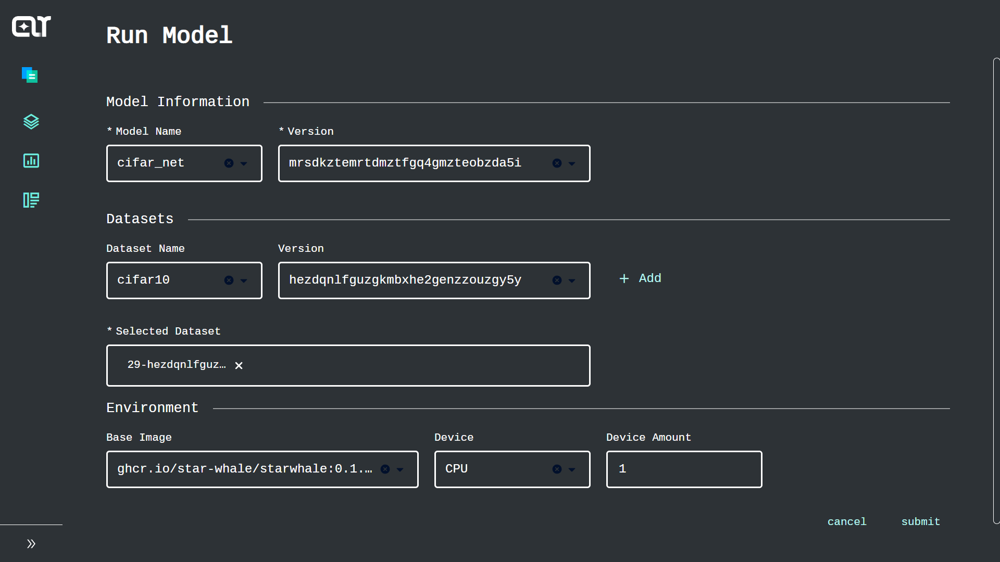
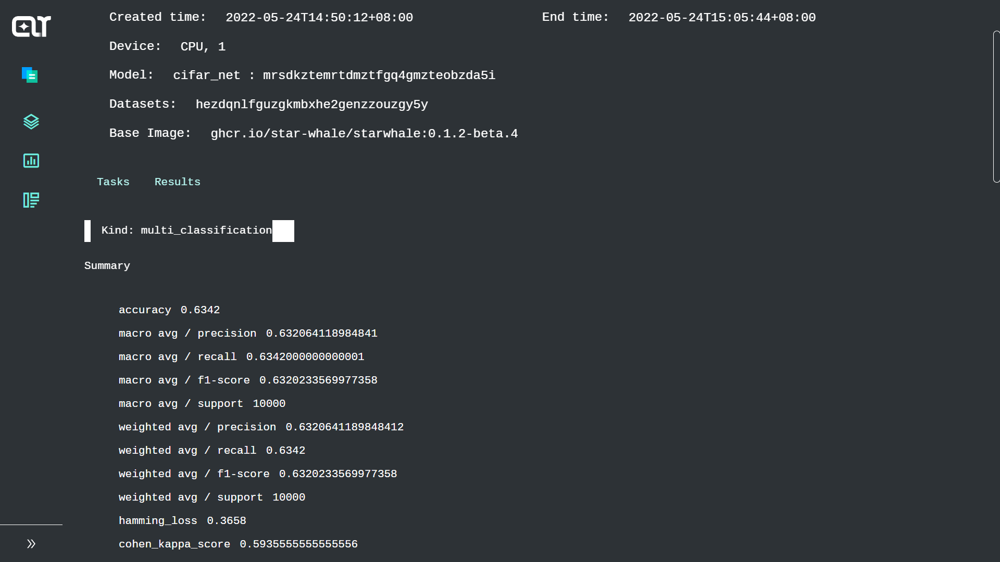
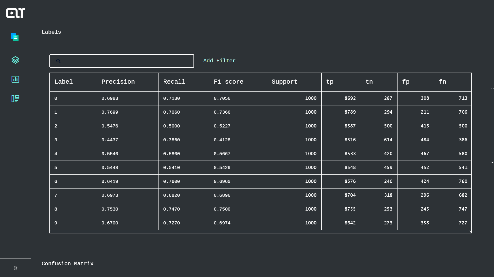
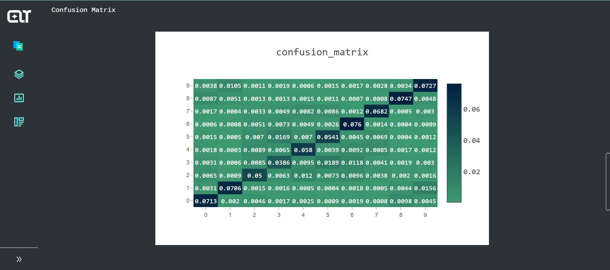
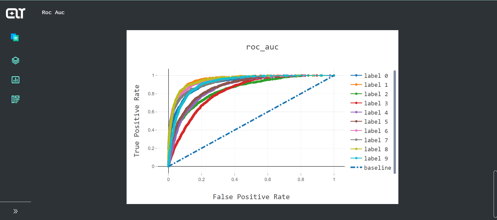

Example of simple classification model trained on CIFAR-10
-----------------
This example will illustrate how to evaluate a pre-trained classification model on StarWhale under 5 steps
* Train the model
* Implement the dataset slicing method
* Implement the inference method and evaluation metrics computing method
* Build SWDS and SWMP
* Run the evaluation job and see the metrics
##Prerequisites
Assume that you have Python3.7 or above installed

Clone starwhale repo and install the requirements
```
git clone https://github.com/star-whale/starwhale.git
cd starwhale/example/cifar10
#create your virtual enviroment if needed
pip install -r requirements.txt
```
> :bulb: If you are from China mainland you're strongly recommended using a proxy
## Train the model
> The training code in this repo is sourced from https://pytorch.org/tutorials/beginner/blitz/cifar10_tutorial.html
```
mkdir models
cd code
python3 train.py
```
The training process is rather slow on your laptop. You could reduce the train epochs in `train.py` to make it faster.

You will get the logs below: 
```
Downloading https://www.cs.toronto.edu/~kriz/cifar-10-python.tar.gz to ../data/cifar-10-python.tar.gz
100.0%
Extracting ../data/cifar-10-python.tar.gz to ../data
[1,  2000] loss: 2.180
[1,  4000] loss: 1.817
[1,  6000] loss: 1.651
[1,  8000] loss: 1.569
[1, 10000] loss: 1.524
[1, 12000] loss: 1.448
[2,  2000] loss: 1.367
......
......
[9, 12000] loss: 0.811
[10,  2000] loss: 0.735
[10,  4000] loss: 0.761
[10,  6000] loss: 0.763
[10,  8000] loss: 0.776
[10, 10000] loss: 0.780
[10, 12000] loss: 0.763
Finished Training
```
Great! Now you have your model trained and saved. You could see it locates in the `models` directory
```
$ ls ../models
cifar_net.pth
```
## Slice the test dataset using Starwhale protocol
In the training section we got a dataset called [CIFA-10](https://www.cs.toronto.edu/~kriz/cifar.html).
```
$ cd ../data
$ ls
cifar-10-batches-py  cifar-10-python.tar.gz
$ ls cifar-10-batches-py 
batches.meta  data_batch_1  data_batch_2  data_batch_3  data_batch_4  data_batch_5  readme.html  test_batch 
```
The test part of the dataset is a single file of size 30MB called `test_batch` which contains 10,000 images and labels.

Before version `0.1.2b7` StarWhale will slice the dataset into chunks where reside the batched images and batched labels. You need to tell StarWhale how to yield batches of byte arrays from each dataset file. 

In this example we will `unpickle` the dataset and get the numpy arrays of each image and a list for all the labels. Then transform them into byte arrays.
```
class CIFAR10Slicer(BuildExecutor):

    def iter_data_slice(self, path: str):
        content_dict = unpickle(path)
        data_numpy = content_dict.get(b'data')
        idx = 0
        data_size = len(data_numpy)
        while True:
            last_idx = idx
            idx = idx + self._batch
            if idx > data_size:
                break
            yield data_numpy[last_idx:idx].tobytes()

    def iter_label_slice(self, path: str):
        content_dict = unpickle(path)
        labels_list = content_dict.get(b'labels')
        idx = 0
        data_size = len(labels_list)
        while True:
            last_idx = idx
            idx = idx + self._batch
            if idx > data_size:
                break
            yield bytes(labels_list[last_idx:idx])

```
You need to extend the abstract class `BuildExecutor` so that your dataset could be used by starwhale. The `path` argument is a file that matches `data_filter` or `label_filter` in `${code_base}/example/cifar10/dataset.yaml`. You could see the filters in this example both are `test_batch`

## Implement the inference method and evaluation metrics computing method  
The inference method is called `ppl` and the evaluation metrics computing method is called `cmp`.
Here is the code snap from `ppl.py` where both methods are implemented. You need to extend the abstract class `PipelineHandler` so that you could receive the byte arrays you just transformed in last step.

```
class CIFAR10Inference(PipelineHandler):

    def __init__(self, device="cpu") -> None:
        super().__init__(merge_label=True, ignore_error=True)
        self.device = torch.device(device)
        self.model = self._load_model(self.device)

    def ppl(self, data, batch_size, **kw):
        data = self._pre(data, batch_size)
        output = self.model(data)
        return self._post(output)

    def handle_label(self, label, batch_size, **kw):
        return [int(l) for l in label]

    @multi_classification(
        confusion_matrix_normalize="all",
        show_hamming_loss=True,
        show_cohen_kappa_score=True,
        show_roc_auc=True,
        all_labels=[i for i in range(0, 10)],
    )
    def cmp(self, _data_loader):
        _result, _label, _pr = [], [], []
        for _data in _data_loader:
            _label.extend([int(l) for l in _data["label"]])
            _result.extend([int(l) for l in _data["result"]])
            _pr.extend([l for l in _data["pr"]])
        return _label, _result, _pr

    def _pre(self, input: bytes, batch_size: int):
        images = []
        from_buffer = np.frombuffer(input, 'uint8')
        shape = (batch_size, ONE_IMAGE_SIZE)
        batch_numpy_flatten_data = from_buffer.reshape(shape)
        batch_numpy_flatten_data = np.vstack([batch_numpy_flatten_data]).reshape(-1, 3, 32, 32)
        batch_numpy_flatten_data = batch_numpy_flatten_data.transpose((0, 2, 3, 1))
        shape_image = (WIDTH_IMAGE, HEIGHT_IMAGE, CHANNEL_IMAGE)
        for i in range(0, batch_size):
            numpy_flatten_data_i_ = batch_numpy_flatten_data[i]
            _image = Image.fromarray(numpy_flatten_data_i_.reshape(shape_image))
            _image = transforms.Compose(
                [transforms.ToTensor(),
                 transforms.Normalize((0.5, 0.5, 0.5), (0.5, 0.5, 0.5))])(_image)
            images.append(_image)
        return torch.stack(images).to(self.device)

    def _post(self, input):
        pred_value = input.argmax(1).flatten().tolist()
        probability_matrix = np.exp(input.tolist()).tolist()
        return pred_value, probability_matrix

    def _load_model(self, device):
        model = Net().to(device)
        model.load_state_dict(torch.load(str(ROOTDIR / "models/cifar_net.pth")))
        model.eval()
        print("load cifar_net model, start to inference...")
        return model

```
### Implement ppl
StarWhale will feed the byte arrays of one batch to the `ppl` method. And take the output of `ppl` into a `inference_result` dict which looks like
```
{"result":[{resultObj1},{resultObj2}],"label":[{labelObj1},{labelObj2}]}
```

Now let's look at how `inference_result` is produced using the byte arrays of one batch.

First we load our model trained before use `_load_model`. Then we transform byte array to tensor which could be a valid input for the model use `_pre`.
And then, we do inference. At the end, we convert the output tensor to label use `_post` method.
By the way, we also overwrite the `handle_label` method.

StarWhale will automatically add result of `ppl` to `inference_result.result` and add result of `handle_label` to `inference_result.label`.

The `inference_result` is used in the argument of `cmp` which is named `_data_loader`.

### Implement cmp
`_data_loader` is an iterator for `result` and `label`. For a multiple classification problem, it is quite easy for you to implement the `cmp` method:

Just annotate your `cmp` method with `multi_classification` annotation and copy the lines inside it
```
    @multi_classification(
        confusion_matrix_normalize="all",
        show_hamming_loss=True,
        show_cohen_kappa_score=True,
        show_roc_auc=True,
        all_labels=[i for i in range(0, 10)],
    )
    def cmp(self, _data_loader):
        _result, _label, _pr = [], [], []
        for _data in _data_loader:
            _label.extend([int(l) for l in _data["label"]])
            _result.extend([int(l) for l in _data["result"]])
            _pr.extend([l for l in _data["pr"]])
        return _label, _result, _pr
```
If you need to show `roc` and `auc`, you will also need to supply `_pr` in your `ppl` method.

By now we have finished all the coding part. Then let's begin the command line part.

## Build SWDS and SWMP
### Build SWDS
#### Write the yaml file
There is some descriptive information needed for StarWhale to build a StarWhale Dataset(SWDS). The information is described by a yaml file like below:
```
name: cifar10

mode: generate

data_dir: data
data_filter: "test_batch"
label_filter: "test_batch"

process: code.data_slicer:CIFAR10Slicer
pip_req: requirements.txt

desc: CIFAR10 data and label test dataset
tag:
 - bin

attr:
  batch_size: 50
  alignment_size: 4k
  volume_size: 2M

```
Most of the fields are self-explained. The `process` descriptor is used to tell StarWhale that 'Hey, use CIFAR10Slicer to slice the dataset please!'. The `data_filter` is used to tell StarWhale to search files that contain data and named like `test_batch` recursively under `data_dir`. Then StarWhale will use the files searched as input for `process`.

After create the yaml file under `${code_base}/example/cifar10/`, we are ready to do it.
```
$ cd ..
$ swcli dataset build .
🆕 swmp version g4ytezbqgfrt
📁 swmp workdir: /home/anda/.cache/starwhale/dataset/cifar10/g4ytezbqgfrtmodche3wcnrupfwta5a
👍 try to copy source code files...
👻 import <code.data_slicer.CIFAR10Slicer object at 0x7faa927a5fa0> to make swds...
cleanup done.
💫 python3.8.13@conda, try to export environment...
🤖 calculate signature...
🌺 congratulation! you can run  swcli dataset info cifar10:g4ytezbqgfrtmodche3wcnrupfwta5a
  8 out of 8 steps finished ━━━━━━━━━━━━━━━━━━━━━━━━━━━━━━━━━━━━━━━━ 100% 0:00:00 0:00:04
```
One step is left to success.
### Build SWMP
#### Write the yaml file
There is some descriptive information needed for StarWhale to build a StarWhale Model Package(SWMP). The information is described by a yaml file like below:
```
version: 1.0
name: cifar_net

model:
  - models/cifar_net.pth

config:
  - config/hyperparam.json

run:
  ppl: code.ppl:CIFAR10Inference
  pip_req: requirements.txt
  exclude_pkg_data:
    - venv
    - .git
    - .history
    - .vscode

desc: cifar10 by pytorch

tag:
  - multi_classification
```
Most of the fields are self-explained. The `ppl` descriptor is used to tell StarWhale that 'Hey, run the inference method and cmp method with CIFAR10Inference please!'.
After create the yaml file under `${code_base}/example/cifar10/`, we are ready to do it.
```
$ swcli model build . --skip-gen-env
🆕 swmp version hfqtimrxgy4g
📁 swmp workdir: /home/anda/.cache/starwhale/workdir/cifar_net/hfqtimrxgy4gcztfgq4gmzten42gc6a
👍 try to copy source code files...
💫 python3.8.13@conda, try to export environment...
🌺 congratulation! you can run  swcli model info cifar_net:hfqtimrxgy4gcztfgq4gmzten42gc6a
  6 out of 6 steps finished ━━━━━━━━━━━━━━━━━━━━━━━━━━━━━━━━━━━━━━━━ 100% 0:00:00 0:00:03
```
There we are. We have finished all the hard parts.

## Run the evaluation job and see the metrics
Before we can really evaluate our model, we should push the SWDS & SWMP to the StarWhale instance
```
$ swcli model push cifar_net:hfqtimrxgy4gcztfgq4gmzten42gc6a
$ swcli dataset push cifar10:g4ytezbqgfrtmodche3wcnrupfwta5a
```
Visit the console, create one job , and watch the evaluation metrics.

**Create one evaluation job**


**Watch the results**





Congratulations, we have finished the whole example! From now on, we can update the training method, get a new model, build a new SWMP and evaluate our model from time to time.
