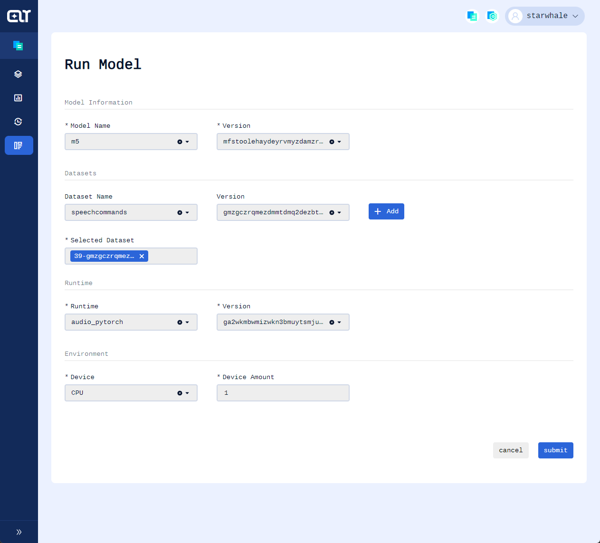

Example of audio classification model trained on SpeechCommands dataset
-----------------
This example will illustrate how to evaluate a pre-trained audio classification model on StarWhale(`version:0.2.0b8`) under 7 steps
* Install StarWhale globally
* Create a Runtime
* Train the model
* Implement the dataset slicing method
* Implement the inference method and evaluation metrics computing method
* Build SWDS & SWMP & SWRT
* Run the evaluation job and see the metrics

## Prerequisites
Assume that you have Python3.7 or above installed.

Clone starwhale repo
```shell
$ git clone https://github.com/star-whale/starwhale.git
$ cd starwhale/example/speech_command
```
> :bulb: If you are from China mainland you're strongly recommended using a proxy

## Install StarWhale globally
```shell
$ pip install starwhale
Installing collected packages: attrs, joblib, scipy, threadpoolctl, scikit-learn, zipp, importlib-metadata, jsonlines, cattrs, requests-toolbelt, filelock, platformdirs, six, distlib, virtualenv, commonmark, pygments, rich, python-dateutil, jmespath, botocore, s3transfer, boto3, loguru, appdirs, fs, pyyaml, conda-pack, starwhale
WARNING: The script virtualenv is installed in '/home/starwhale/.local/bin' which is not on PATH.

$ pip list | grep starwhale
starwhale          0.2.0b8
$ swcli instance select local
```
If below warning tip shows, please add `~/.local/bin` to your `PATH`

```
WARNING: The script virtualenv is installed in '~/.local/bin' which is not on PATH.
```


## Create a Runtime
```shell
$ swcli runtime create . --name audio_pytorch -m venv --python=3.8 --force
🚧 start to create runtime environment...
👏 create venv@~/code/starwhale/example/speech_command/venv, python:3.8.10 (default, Mar 15 2022, 12:22:08)
[GCC 9.4.0]
🐶 install starwhale==0.2.0b8 venv@~/code/starwhale/example/speech_command/venv...
🍰 run command in shell 🍰
        ~/code/starwhale/example/speech_command/venv/bin/activate
👏 python runtime environment is ready to use 🎉
$ source ~/code/starwhale/example/speech_command/venv/bin/activate
(audio_pytorch) $  python3 -m pip install -r requirements.txt
```

> :bulb: make sure python3.8-venv is installed if you choose --python=3.8

> :bulb: `python3 -m pip install` is recommended over `pip install`


## Train the model
> The training code in this repo is sourced from https://pytorch.org/tutorials/intermediate/speech_command_classification_with_torchaudio_tutorial.html. However, some code is modified so that we could better understand how StarWhale works. 
```shell
(audio_pytorch) $ mkdir models
(audio_pytorch) $ cd code
(audio_pytorch) $ python train.py
```
You will get the logs below:
```shell
  0%|                                                          | 0/1 [00:00<?, ?it/s]Train Epoch: 1 [0/84843 (0%)]   Loss: 3.755602
  5%|███▊                                                      | 0.047846889952153096/1 [00:18<06:13, 392.78s/it]Train Epoch: 1 [5120/84843 (6%)]        Loss: 3.069063
 10%|██████▋                                                   | 0.09569377990430618/1 [00:36<05:49, 386.05s/it]Train Epoch: 1 [10240/84843 (12%)]      Loss: 2.678599
 14%|████████▍                                                 | 0.14354066985645936/1 [00:53<04:53, 342.60s/it]Train Epoch: 1 [15360/84843 (18%)]      Loss: 2.131145
 19%|███████████▎                                              | 0.19138755980861272/1 [01:10<04:33, 338.02s/it]Train Epoch: 1 [20480/84843 (24%)]      Loss: 2.012789
 24%|██████████████                                            | 0.23923444976076608/1 [01:27<05:03, 398.31s/it]Train Epoch: 1 [25600/84843 (30%)]      Loss: 1.740537
 29%|████████████████▉                                         | 0.28708133971291944/1 [01:44<04:34, 385.32s/it]Train Epoch: 1 [30720/84843 (36%)]      Loss: 1.725273
 33%|███████████████████                                       | 0.3349282296650728/1 [02:02<04:06, 371.29s/it]Train Epoch: 1 [35840/84843 (42%)]      Loss: 1.671064
 38%|██████████████████████▌                                   | 0.38277511961722616/1 [02:19<03:43, 362.65s/it]Train Epoch: 1 [40960/84843 (48%)]      Loss: 1.381939
 43%|█████████████████████████▊                                | 0.4306220095693795/1 [02:36<03:15, 342.59s/it]Train Epoch: 1 [46080/84843 (54%)]      Loss: 1.435907
 48%|███████████████████████████▌                              | 0.4784688995215329/1 [02:55<03:25, 393.13s/it]Train Epoch: 1 [51200/84843 (60%)]      Loss: 1.576231
 53%|██████████████████████████████▍                           | 0.5263157894736856/1 [03:13<02:38, 335.18s/it]Train Epoch: 1 [56320/84843 (66%)]      Loss: 1.206882
 57%|█████████████████████████████████▎                        | 0.5741626794258379/1 [03:29<02:32, 357.79s/it]Train Epoch: 1 [61440/84843 (72%)]      Loss: 1.126174
 62%|████████████████████████████████████▏                     | 0.6220095693779901/1 [03:46<02:05, 331.93s/it]Train Epoch: 1 [66560/84843 (78%)]      Loss: 1.345579
 67%|██████████████████████████████████████                    | 0.6698564593301424/1 [04:02<01:48, 328.73s/it]Train Epoch: 1 [71680/84843 (84%)]      Loss: 1.211446
 72%|█████████████████████████████████████████▉                | 0.7177033492822946/1 [04:18<01:33, 330.40s/it]Train Epoch: 1 [76800/84843 (90%)]      Loss: 1.104123
 77%|████████████████████████████████████████████▊             | 0.7655502392344469/1 [04:34<01:20, 344.70s/it]Train Epoch: 1 [81920/84843 (96%)]      Loss: 1.253487
100%|█████████████████████████████████████████████████████████▉| 0.9999999999999929/1 [05:53<00:00, 353.79s/it]
Test Epoch: 1   Accuracy: 12200/22010 (55%)

100%|█████████████████████████████████████████████████████████▉| 0.9999999999999929/1 [05:53<00:00, 353.91s/it]
```
Great! Now you have your model trained and saved. You could see it locates in the `models` directory
```shell
(audio_pytorch) $ ls ../models
m5.pth
```
## Slice the test dataset using Starwhale protocol
In the training section we use a dataset called [SpeechCommands](https://paperswithcode.com/dataset/speech-commands).
```shell
(audio_pytorch) $ ls ../data
SpeechCommands  speech_commands_v0.02.tar.gz
```

Before version `0.2.x` StarWhale will slice the dataset into chunks where reside the batched audios and batched labels. You need to tell StarWhale how to yield batches of byte arrays from files in the dataset.

In order to read all test files in this dataset, we overwrite `load_list` method of parent class `BuildExecutor` in StarWhale sdk.
In order to package audios and labels in batch and convert them into byte array, we overwrite `iter_all_dataset_slice` and `iter_all_label_slice` method of parent class `BuildExecutor` in StarWhale sdk.
We package audios' path into `FileBytes` which could make us easy to debug.
```python
class FileBytes:
    def __init__(self, p):
        self.file_path = p
        self.content_bytes = open(p, "rb").read()


def _pickle_data(audio_file_paths):
    all_bytes = [FileBytes(audio_f) for audio_f in audio_file_paths]
    return pickle.dumps(all_bytes)


def _pickle_label(audio_file_paths):
    all_strings = [os.path.basename(os.path.dirname(str(audio_f))) for audio_f
                   in audio_file_paths]
    return pickle.dumps(all_strings)


class SpeechCommandsSlicer(BuildExecutor):

    def load_list(self, file_filter):
        filepath = self.data_dir / file_filter
        with open(filepath) as fileobj:
            return [self.data_dir / line.strip() for line in fileobj]

    def _iter_files(
        self, file_filter: str, sort_key: t.Optional[t.Any] = None
    ) -> t.Generator[Path, None, None]:
        _key = sort_key
        if _key is not None and not callable(_key):
            raise Exception(f"data_sort_func({_key}) is not callable.")

        _files = sorted(self.load_list(file_filter), key=_key)
        for p in _files:
            if not p.is_file():
                continue
            yield p

    def iter_data_slice(self, path: str):
        pass

    def iter_label_slice(self, path: str):
        pass

    def iter_all_dataset_slice(self) -> t.Generator[t.Any, None, None]:
        datafiles = [p for p in self.iter_data_files()]
        idx = 0
        data_size = len(datafiles)
        while True:
            last_idx = idx
            idx = idx + self._batch
            if idx > data_size:
                break
            yield _pickle_data(datafiles[last_idx:idx])

    def iter_all_label_slice(self) -> t.Generator[t.Any, None, None]:
        datafiles = [p for p in self.iter_data_files()]
        idx = 0
        data_size = len(datafiles)
        while True:
            last_idx = idx
            idx = idx + self._batch
            if idx > data_size:
                break
            yield _pickle_label(datafiles[last_idx:idx])


```
You need to extend the abstract class `BuildExecutor` so that your dataset could be used by StarWhale.

## Implement the inference method and evaluation metrics computing method
The inference method is called `ppl` and the evaluation metrics computing method is called `cmp`.
Here is the code snap from `ppl.py` where both methods are implemented. You need to extend the abstract class `PipelineHandler` so that you could receive the byte arrays you just transformed in last step.

```python
class M5Inference(PipelineHandler):

    def __init__(self, device="cpu") -> None:
        super().__init__(merge_label=True, ignore_error=True)
        self.device = torch.device(device)
        self.model = self._load_model(self.device)
        self.transform = torchaudio.transforms.Resample(orig_freq=16000,
                                                        new_freq=8000)
        self.transform = self.transform.to(device)

    def ppl(self, data, batch_size, **kw):
        audios = self._pre(data, batch_size)
        result = []
        for audio_f in audios:
            try:
                label_idx = self.model(audio_f.unsqueeze(0)).argmax(
                    dim=-1).squeeze()
                result.append(labels[label_idx])
            except Exception:
                result.append('ERROR')
        return result, None

    def handle_label(self, label, batch_size, **kw):
        return pickle.loads(label)

    @multi_classification(
        confusion_matrix_normalize="all",
        show_hamming_loss=True,
        show_cohen_kappa_score=True,
        show_roc_auc=False,
        all_labels=labels,
    )
    def cmp(self, _data_loader):
        _result, _label, _pr = [], [], []
        for _data in _data_loader:
            _label.extend(_data["label"])
            _result.extend(_data["result"])
            # _pr.extend(_data["pr"])
        return _result, _label

    def _pre(self, input: bytes, batch_size: int):
        audios = pickle.loads(input)
        _result = []
        for file_bytes in audios:
            # you could debug the file name by watching file_bytes.file_path
            bytes_io = io.BytesIO(file_bytes.content_bytes)
            test_tensor = torchaudio.load(bytes_io)[0].to(self.device)
            test_tensor = self.transform(test_tensor)
            _result.append(test_tensor.to(self.device))
        return _result

    def _post(self, input):
        pred_value = input.argmax(1).flatten().tolist()
        probability_matrix = np.exp(input.tolist()).tolist()
        return pred_value, probability_matrix

    def _load_model(self, device):
        model = M5(n_input=1, n_output=35)
        model.load_state_dict(torch.load(str(ROOTDIR / "models/m5.pth")))
        model.to(device)
        model.eval()
        print("m5 model loaded, start to inference...")
        return model

```
### Implement ppl
StarWhale will feed the byte arrays of one batch to the `ppl` method. And take the output of `ppl` into a `inference_result` dict which looks like
```json
{"result":[{resultObj1},{resultObj2}],"label":[{labelObj1},{labelObj2}]}
```

StarWhale will automatically add result of `ppl` to `inference_result.result` and add result of `handle_label` to `inference_result.label`.

The `inference_result` is used in the argument of `cmp` which is named `_data_loader`.

### Implement cmp
`_data_loader` is an iterator for `result` and `label`. For a multiple classification problem, it is quite easy for you to implement the `cmp` method:

Just annotate your `cmp` method with `multi_classification` annotation and copy the lines inside it.  

If you need to show `roc` and `auc`, you will also need to supply `_pr` in your `ppl` method.

By now we have finished all the coding part. Then let's begin the command line part.

## Build SWRT & SWDS & SWMP 
### Build SWRT

```shell
(audio_pytorch) $ cd ..
(audio_pytorch) $ swcli runtime build .
🚧 start to build runtime bundle...
👷 uri:local/project/self/runtime/audio_pytorch
🐦 runtime will ignore pypi editable package
🆕 version ga2wkmbwmizw
📁 workdir: /home/anda/.cache/starwhale/self/workdir/runtime/audio_pytorch/ga/ga2wkmbwmizwkn3bmuytsmjunv3dc3q
💫 python3.8.10@venv, os(Linux), include-editable(False), try to export environment...
🌈 runtime docker image: ghcr.io/star-whale/starwhale:0.2.0b8  🌈
🦋 .swrt bundle:/home/anda/.cache/starwhale/self/runtime/audio_pytorch/ga/ga2wkmbwmizwkn3bmuytsmjunv3dc3q.swrt
  7 out of 7 steps finished ━━━━━━━━━━━━━━━━━━━━━━━━━━━━━━━━━━━━━━━━ 100% 0:00:00 0:00:02
```
```shell
(audio_pytorch) $ swcli runtime list
╭─ Starwhale Instance ──────────────────────────────────────────────────────────────────────────────────────────────────────────────────────╮
│                                                     ⭐ local (local) 🐳                                                     🤡anda@normal │
╰───────────────────────────────────────────────────────────────────────────────────────────────────────────────────────────────────────────╯
                                                                 Bundle List

  Name                       Version                  Tags           Size            Runtime         Created
 ───────────────────────────────────────────────────────────────────────────────────────────────────────────────────────────────────────────
  audio_pytorch              my4tizjumrtd                            20.00KB         --              2022-06-21 14:40:03 CST
  audio_pytorch              ga2wkmbwmizw             latest         20.00KB         --              2022-06-21 18:43:47 CST
  pytorch_text               hbtdqnztmy2d             latest         20.00KB         --              2022-06-09 18:26:03 CST

```


### Build SWDS
#### Write the yaml file
There is some descriptive information needed for StarWhale to build a StarWhale Dataset(SWDS). The information is described by a yaml file like below:
```yaml
name: SpeechCommands

mode: generate

data_dir: data/SpeechCommands/speech_commands_v0.02
data_filter: "testing_list.txt"
label_filter: "testing_list.txt"

process: code.data_slicer:SpeechCommandsSlicer

desc: SpeechCommands data and label test dataset
tag:
  - bin

attr:
  batch_size:  256
  alignment_size: 4k
  volume_size: 64M

```
Most of the fields are self-explained. The `process` descriptor is used to tell StarWhale that 'Hey, use SpeechCommandsSlicer to slice the dataset please!'.  Then StarWhale will use the files locate in `testing_list.txt` as input for `process`.

After create the yaml file under `${code_base}/example/speech_command/`, we are ready to do it.
```shell
(audio_pytorch) $ swcli dataset build . 
🚧 start to build dataset bundle...
👷 uri:local/project/self/dataset/speechcommands
🆕 version gmzgczrqmezd
📁 swds workdir: /home/anda/.cache/starwhale/self/dataset/speechcommands/gm/gmzgczrqmezdmmtdmq2dezbtmjqtimq.swds
👍 try to copy source code files...
🗣  swcli python prefix:/usr, runtime env python prefix:/mnt/c/Users/renyanda/Documents/code/starwhale/example/speech_command/venv, swcli will inject sys.path
👻 import code.data_slicer:SpeechCommandsSlicer@/mnt/c/Users/renyanda/Documents/code/starwhale/example/speech_command to make swds...
cleanup done.
finish gen swds @ /home/anda/.cache/starwhale/self/dataset/speechcommands/gm/gmzgczrqmezdmmtdmq2dezbtmjqtimq.swds/data
🤖 calculate signature...
🌺 congratulation! you can run  swcli dataset info speechcommands/version/gmzgczrqmezdmmtdmq2dezbtmjqtimq
  8 out of 8 steps finished ━━━━━━━━━━━━━━━━━━━━━━━━━━━━━━━━━━━━━━━━ 100% 0:00:00 0:01:54
```
One step is left to success.
### Build SWMP
#### Write the yaml file
There is some descriptive information needed for StarWhale to build a StarWhale Model Package(SWMP). The information is described by a yaml file like below:
```yaml
version: 1.0
name: m5

model:
  - models/m5.pth

run:
  ppl: code.ppl:M5Inference

desc: m5 by pytorch

tag:
  - speech command clasification
```
Most of the fields are self-explained. The `ppl` descriptor is used to tell StarWhale that 'Hey, run the inference method and cmp method with M5Inference please!'.
After create the yaml file under `${code_base}/example/speech_command/`, we are ready to do it.
```shell
(audio_pytorch) $ swcli model build . 
🚧 start to build model bundle...
👷 uri:local/project/self/model/m5
🆕 version mfstoolehayd
📁 workdir: /home/anda/.cache/starwhale/self/workdir/model/m5/mf/mfstoolehaydeyrvmyzdamzrmzshuma
👍 try to copy source code files...
🦋 .swmp bundle:/home/anda/.cache/starwhale/self/model/m5/mf/mfstoolehaydeyrvmyzdamzrmzshuma.swmp
  6 out of 6 steps finished ━━━━━━━━━━━━━━━━━━━━━━━━━━━━━━━━━━━━━━━━ 100% 0:00:00 0:00:17
```
```shell
(audio_pytorch) $ swcli model list  
╭─ Starwhale Instance ──────────────────────────────────────────────────────────────────────────────────────────────────────────────────────╮
│                                                     ⭐ local (local) 🐳                                                     🤡anda@normal │
╰───────────────────────────────────────────────────────────────────────────────────────────────────────────────────────────────────────────╯
                                                                 Bundle List

  Name                 Version                   Tags           Size               Runtime          Created
 ───────────────────────────────────────────────────────────────────────────────────────────────────────────────────────────────────────────
  m5                   mfstoolehayd              latest         89.63MB                             2022-06-21 18:48:27 CST
```
```shell
(audio_pytorch) $ swcli model info m5/version/mfstoolehayd
╭─ Starwhale Instance ──────────────────────────────────────────────────────────────────────────────────────────────────────────────────────╮                                                     ⭐ local (local) 🐳                                                     🤡anda@normal │╰───────────────────────────────────────────────────────────────────────────────────────────────────────────────────────────────────────────╯────────────────────────────────────────────────────────────── Inspect Details ──────────────────────────────────────────────────────────────
                                                    ⭐ local (local) 🐳                                                     🤡anda@normal    
╰───────────────────────────────────────────────────────────────────────────────────────────────────────────────────────────────────────────╯
────────────────────────────────────────────────────────────── Inspect Details ──────────────────────────────────────────────────────────────
{
    'uri': 'local/project/self/model/m5/version/mfstoolehayd',
    'project': 'self',
    'name': 'm5',
    'snapshot_workdir': '/home/anda/.cache/starwhale/self/workdir/model/m5/mf/mfstoolehaydeyrvmyzdamzrmzshuma',
    'bundle_path': '/home/anda/.cache/starwhale/self/model/m5/mf/mfstoolehaydeyrvmyzdamzrmzshuma.swmp',
    'version': 'mfstoolehaydeyrvmyzdamzrmzshuma',
    'config': {
        'build': {
            'os': 'Linux',
            'sw_version': '0.2.0b8'
        },
        'created_at': '2022-06-21 18:48:27 CST',
        'name': 'm5',
        'user_raw_config': {
            'config': [],
            'desc': 'm5 by pytorch',
            'kw': {},
            'model': [
                'models/m5.pth'
            ],
            'name': 'm5',
            'run': {
                'envs': [],
                'exclude_pkg_data': [],
                'kw': {},
                'pkg_data': [],
                'ppl': 'code.ppl:M5Inference',
                'runtime': ''
            },
            'tag': [
                'speech command clasification'
            ],
            'version': 1.0
        },
        'version': 'mfstoolehaydeyrvmyzdamzrmzshuma'
    },
    'tags': [
        'latest'
    ]
}
```

There we are. We have finished all the hard parts.

## Run the evaluation job and see the metrics

We have two ways to evaluate our model
- Evaluate model on local instance
- Evaluate model on cloud instance

### Evaluate model on local instance

#### Create the job
```shell
$ swcli job create self --model m5/version/latest --dataset speechcommands/version/latest --runtime audio_pytorch/version/latest
😹 /home/anda/.cache/starwhale/self/workdir/model/m5/mf/mfstoolehaydeyrvmyzdamzrmzshuma existed, skip extract model bundle
👏 render swds speechcommands:gmzgczrqmezdmmtdmq2dezbtmjqtimq local_fuse.json
🔍 /home/anda/.cache/starwhale/self/dataset/speechcommands/gm/gmzgczrqmezdmmtdmq2dezbtmjqtimq.swds/local_fuse.json
try to import code.ppl:M5Inference@/home/anda/.cache/starwhale/self/workdir/model/m5/mf/mfstoolehaydeyrvmyzdamzrmzshuma/src...
🗣  swcli python prefix:/usr, runtime env python prefix:/mnt/c/Users/renyanda/Documents/code/starwhale/example/speech_command/venv, swcli will inject sys.path
m5 model loaded, start to inference...
👏 finish run ppl: PipelineHandler status@/home/anda/.cache/starwhale/self/job/gu/gu2doojqmi2tmzrtgzqwinlfgq2wy3q/ppl/status, log@/home/anda/.cache/starwhale/self/job/gu/gu2doojqmi2tmzrtgzqwinlfgq2wy3q/ppl/log, result@/home/anda/.cache/starwhale/self/job/gu/gu2doojqmi2tmzrtgzqwinlfgq2wy3q/ppl/result
try to import code.ppl:M5Inference@/home/anda/.cache/starwhale/self/workdir/model/m5/mf/mfstoolehaydeyrvmyzdamzrmzshuma/src...
🗣  swcli python prefix:/usr, runtime env python prefix:/mnt/c/Users/renyanda/Documents/code/starwhale/example/speech_command/venv, swcli will inject sys.path
m5 model loaded, start to inference...
/mnt/c/Users/renyanda/Documents/code/starwhale/example/speech_command/venv/lib/python3.8/site-packages/sklearn/metrics/_classification.py:1327: UndefinedMetricWarning: Precision and F-score are ill-defined and being set to 0.0 in labels with no predicted samples. Use `zero_division` parameter to control this behavior.
  _warn_prf(average, modifier, msg_start, len(result))
/mnt/c/Users/renyanda/Documents/code/starwhale/example/speech_command/venv/lib/python3.8/site-packages/sklearn/metrics/_classification.py:1327: UndefinedMetricWarning: Precision and F-score are ill-defined and being set to 0.0 in labels with no predicted samples. Use `zero_division` parameter to control this behavior.
  _warn_prf(average, modifier, msg_start, len(result))
/mnt/c/Users/renyanda/Documents/code/starwhale/example/speech_command/venv/lib/python3.8/site-packages/sklearn/metrics/_classification.py:1327: UndefinedMetricWarning: Precision and F-score are ill-defined and being set to 0.0 in labels with no predicted samples. Use `zero_division` parameter to control this behavior.
  _warn_prf(average, modifier, msg_start, len(result))
👏 finish run cmp: PipelineHandler status@/home/anda/.cache/starwhale/self/job/gu/gu2doojqmi2tmzrtgzqwinlfgq2wy3q/cmp/status, log@/home/anda/.cache/starwhale/self/job/gu/gu2doojqmi2tmzrtgzqwinlfgq2wy3q/cmp/log, result@/home/anda/.cache/starwhale/self/job/gu/gu2doojqmi2tmzrtgzqwinlfgq2wy3q/cmp/result
  7 out of 7 steps finished ━━━━━━━━━━━━━━━━━━━━━━━━━━━━━━━━━━━━━━━━ 100% 0:00:00 0:00:37
👏 success to create job(project id: local/project/self)
🐦 run cmd to fetch job info: swcli job info gu2doojqmi2t
```
#### See the metrics
```shell
(audio_pytorch) $ swcli job info gu2doojqmi2t
╭─ Starwhale Instance ──────────────────────────────────────────────────────────────────────────────────────────────────────────────────────╮
│                                                     ⭐ local (local) 🐳                                                     🤡anda@normal │
╰───────────────────────────────────────────────────────────────────────────────────────────────────────────────────────────────────────────╯
──────────────────────────────────── Inspect _manifest.yaml for eval:local/project/self/job/gu2doojqmi2t ────────────────────────────────────
{
    'created_at': '2022-06-21 18:53:05 CST',
    'datasets': [
        'local/project/self/dataset/speechcommands/version/latest'
    ],
    'desc': None,
    'finished_at': '2022-06-21 18:53:43 CST',
    'model': 'm5/version/latest',
    'model_dir': '/home/anda/.cache/starwhale/self/workdir/model/m5/mf/mfstoolehaydeyrvmyzdamzrmzshuma/src',
    'name': None,
    'phase': 'all',
    'runtime': 'audio_pytorch/version/latest',
    'status': 'success',
    'version': 'gu2doojqmi2tmzrtgzqwinlfgq2wy3q'
}
────────────────────────────────────────────────────────── Evaluation process dirs ──────────────────────────────────────────────────────────
🌵 ppl: /home/anda/.cache/starwhale/self/job/gu/gu2doojqmi2tmzrtgzqwinlfgq2wy3q/ppl
🐫 cmp: /home/anda/.cache/starwhale/self/job/gu/gu2doojqmi2tmzrtgzqwinlfgq2wy3q/cmp
──────────────────────────────────────────────────────── MULTI_CLASSIFICATION Report ────────────────────────────────────────────────────────
Summary
├── accuracy: 0.5372                                Label      Precision   Recall   F1-score   Support
├── macro avg                                      ──────────────────────────────────────────────────────
│   ├── precision: 0.5152                           backward   0.5394      0.9368   0.6846     190.0000
│   ├── recall: 0.6146                              bed        0.2995      0.4559   0.3615     272.0000
│   ├── f1-score: 0.5241                            bird       0.3622      0.4085   0.3840     328.0000
│   └── support: 21760.0000                         cat        0.4948      0.4898   0.4923     392.0000
├── weighted avg                                    dog        0.3364      0.5481   0.4169     270.0000
│   ├── precision: 0.5927                           down       0.6478      0.6415   0.6446     820.0000
│   ├── recall: 0.5372                              eight      0.4926      0.7417   0.5920     542.0000
│   ├── f1-score: 0.5247                            five       0.7416      0.5946   0.6600     1110.0000
│   └── support: 21760.0000                         follow     0.5058      0.5472   0.5257     318.0000
├── hamming_loss: 0.4628                            forward    0.3097      0.6076   0.4103     158.0000
└── cohen_kappa_score: 0.5231                       four       0.6400      0.5995   0.6191     854.0000
                                                    go         0.2736      0.6145   0.3787     358.0000
                                                    happy      0.6847      0.8176   0.7453     340.0000
                                                    house      0.7749      0.2919   0.4241     1014.0000
                                                    learn      0.3416      0.5189   0.4120     212.0000
                                                    left       0.4539      0.7165   0.5557     522.0000
                                                    marvin     0.5436      0.8346   0.6584     254.0000
                                                    nine       0.5833      0.7653   0.6620     622.0000
                                                    no         0.2568      0.8814   0.3977     236.0000
                                                    off        0.6219      0.5910   0.6061     846.0000
                                                    on         0.7146      0.7093   0.7119     798.0000
                                                    one        0.5439      0.8411   0.6606     516.0000
                                                    right      0.5354      0.7186   0.6136     590.0000
                                                    seven      0.7438      0.5374   0.6240     1124.0000
                                                    sheila     0.8396      0.3321   0.4759     1072.0000
                                                    six        0.8909      0.4067   0.5585     1726.0000
                                                    stop       0.7421      0.5360   0.6224     1138.0000
                                                    three      0.3827      0.4282   0.4042     724.0000
                                                    tree       0.7098      0.2171   0.3325     1262.0000
                                                    two        0.2712      0.6647   0.3853     346.0000
                                                    up         0.2635      0.8889   0.4065     252.0000
                                                    visual     0.4970      0.9011   0.6406     182.0000
                                                    wow        0.3883      0.8989   0.5424     178.0000
                                                    yes        0.6205      0.7450   0.6771     698.0000
                                                    zero       0.4983      0.6986   0.5817     418.0000
                                                    ERROR      0.0000      0.0000   0.0000     1078.0000

─────────────────────────────────────────────────── MULTI_CLASSIFICATION Confusion Matrix ───────────────────────────────────────────────────

  Label      TP      TN    FP     FN
 ─────────────────────────────────────    ──────────────────────────────────────────────────────────────────────────────────────────────────
  ERROR      21418   152   12     178
  backward   21198   290   148    124
  bed        21196   236   194    134
  bird       21172   196   200    192
  cat        21198   292   122    148
  dog        20654   286   294    526
  down       20804   414   140    402
  eight      20420   230   450    660
  five       21272   170   144    174
  follow     21388   214   62     96
  forward    20618   288   342    512
  four       20818   584   138    220
  go         21292   128   62     278
  happy      20660   86    718    296
  house      21336   212   102    110
  learn      20788   450   148    374
  left       21328   178   42     212
  marvin     20798   340   146    476
  nine       20922   602   28     208
  no         20610   304   346    500
  off        20736   226   232    566
  on         20880   364   82     434
  one        20802   368   166    424
  right      20428   208   520    604
  seven      20620   68    716    356
  sheila     19948   86    1024   702
  six        20410   212   528    610
  stop       20536   500   414    310
  three      20386   112   988    274
  tree       20796   618   116    230
  two        20882   626   28     224
  up         21412   166   18     164
  visual     21330   252   18     160
  wow        20744   318   178    520
  yes        21048   294   126    292
  zero       20682   0     1078   0
```
> :bulb: Docker is required to start as demon on the machine

Congratulations, we have nearly finished the whole example! From now on, we can update the training method, get a new model, build a new SWMP and evaluate our model from time to time.

### Evaluate model on cloud instance

**Login on one cloud instance**
```shell
(audio_pytorch) $ swcli instance login http://console.pre.intra.starwhale.ai --username starwhale --password abcd1234 --alias pre-k8s
‍🍳 login http://console.pre.intra.starwhale.ai successfully!
```

**Copy the model we build before to cloud instance**
```shell
(audio_pytorch) $ swcli model copy m5/version/mfstoolehayd cloud://pre-k8s/project/1
🚧 start to copy local/project/self/model/m5/version/mfstoolehayd -> http://console.pre.intra.starwhale.ai/project/1...
  🎳 upload mfstoolehaydeyrvmyzdamzrmzshuma.swmp ━━━━━━━━━━━━━━━━━━━━━━━━━━━━━━━━━━━━━━━━ 100% 0:00:07 94.0 MB 10.0 MB/s
👏 copy done.
```
**Copy the dataset we build before to cloud instance**
```shell
(audio_pytorch) $ swcli dataset copy speechcommands/version/gmzgczrqmezd cloud://pre-k8s/project/1
🚧 start to copy local/project/self/dataset/speechcommands/version/gmzgczrqmezd -> http://console.pre.intra.starwhale.ai/project/1...
  ⬆ _manifest.yaml         ━━━━━━━━━━━━━━━━━━━━━━━━━━━━━━━━━━━━━━━━ 100% 0:00:00 4.3 kB  ?
  ⬆ data_ubyte_0.swds_bin  ━━━━━━━━━━━━━━━━━━━━━━━━━━━━━━━━━━━━━━━━ 100% 0:00:05 72.3 MB 9.6 MB/s
  ⬆ data_ubyte_1.swds_bin  ━━━━━━━━━━━━━━━━━━━━━━━━━━━━━━━━━━━━━━━━ 100% 0:00:13 72.8 MB 9.7 MB/s
  ⬆ data_ubyte_2.swds_bin  ━━━━━━━━━━━━━━━━━━━━━━━━━━━━━━━━━━━━━━━━ 100% 0:00:21 72.6 MB 9.7 MB/s
  ⬆ data_ubyte_3.swds_bin  ━━━━━━━━━━━━━━━━━━━━━━━━━━━━━━━━━━━━━━━━ 100% 0:00:29 72.6 MB 9.7 MB/s
  ⬆ data_ubyte_4.swds_bin  ━━━━━━━━━━━━━━━━━━━━━━━━━━━━━━━━━━━━━━━━ 100% 0:00:37 73.0 MB 9.8 MB/s
  ⬆ data_ubyte_5.swds_bin  ━━━━━━━━━━━━━━━━━━━━━━━━━━━━━━━━━━━━━━━━ 100% 0:00:45 72.8 MB 9.4 MB/s
  ⬆ data_ubyte_6.swds_bin  ━━━━━━━━━━━━━━━━━━━━━━━━━━━━━━━━━━━━━━━━ 100% 0:00:53 72.8 MB 9.6 MB/s
  ⬆ data_ubyte_7.swds_bin  ━━━━━━━━━━━━━━━━━━━━━━━━━━━━━━━━━━━━━━━━ 100% 0:01:01 72.7 MB 9.7 MB/s
  ⬆ data_ubyte_8.swds_bin  ━━━━━━━━━━━━━━━━━━━━━━━━━━━━━━━━━━━━━━━━ 100% 0:01:09 72.5 MB 9.7 MB/s
  ⬆ data_ubyte_9.swds_bin  ━━━━━━━━━━━━━━━━━━━━━━━━━━━━━━━━━━━━━━━━ 100% 0:01:13 32.5 MB 6.9 MB/s
  ⬆ index.jsonl            ━━━━━━━━━━━━━━━━━━━━━━━━━━━━━━━━━━━━━━━━ 100% 0:01:15 15.2 kB ?
  ⬆ label_ubyte_0.swds_bin ━━━━━━━━━━━━━━━━━━━━━━━━━━━━━━━━━━━━━━━━ 100% 0:01:15 36.6 kB ?
  ⬆ label_ubyte_1.swds_bin ━━━━━━━━━━━━━━━━━━━━━━━━━━━━━━━━━━━━━━━━ 100% 0:01:15 36.6 kB ?
  ⬆ label_ubyte_2.swds_bin ━━━━━━━━━━━━━━━━━━━━━━━━━━━━━━━━━━━━━━━━ 100% 0:01:15 36.6 kB ?
  ⬆ label_ubyte_3.swds_bin ━━━━━━━━━━━━━━━━━━━━━━━━━━━━━━━━━━━━━━━━ 100% 0:01:15 36.6 kB ?
  ⬆ label_ubyte_4.swds_bin ━━━━━━━━━━━━━━━━━━━━━━━━━━━━━━━━━━━━━━━━ 100% 0:01:15 36.6 kB ?
  ⬆ label_ubyte_5.swds_bin ━━━━━━━━━━━━━━━━━━━━━━━━━━━━━━━━━━━━━━━━ 100% 0:01:15 36.6 kB ?
  ⬆ label_ubyte_6.swds_bin ━━━━━━━━━━━━━━━━━━━━━━━━━━━━━━━━━━━━━━━━ 100% 0:01:15 36.6 kB ?
  ⬆ label_ubyte_7.swds_bin ━━━━━━━━━━━━━━━━━━━━━━━━━━━━━━━━━━━━━━━━ 100% 0:01:15 36.6 kB ?
  ⬆ label_ubyte_8.swds_bin ━━━━━━━━━━━━━━━━━━━━━━━━━━━━━━━━━━━━━━━━ 100% 0:01:15 36.6 kB ?
  ⬆ label_ubyte_9.swds_bin ━━━━━━━━━━━━━━━━━━━━━━━━━━━━━━━━━━━━━━━━ 100% 0:01:15 16.3 kB ?
  ⬆ archive.swds_meta      ━━━━━━━━━━━━━━━━━━━━━━━━━━━━━━━━━━━━━━━━ 100% 0:01:23 93.9 MB 10.0 MB/s
👏 copy done
```
**Copy the runtime we build before to cloud instance**
```shell
(audio_pytorch) $ swcli runtime copy audio_pytorch/version/ga2wkmbwmizw cloud://pre-k8s/project/1
🚧 start to copy local/project/self/runtime/audio_pytorch/version/ga2wkmbwmizw -> http://console.pre.intra.starwhale.ai/project/1...
  🎳 upload ga2wkmbwmizwkn3bmuytsmjunv3dc3q.swrt ━━━━━━━━━━━━━━━━━━━━━━━━━━━━━━━━━━━━━━━━ 100% 0:00:00 20.5 kB ?
👏 copy done.
```

**Go to the console and create one job**

