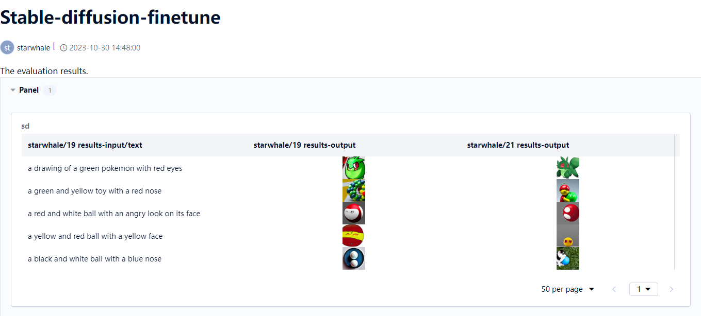

# Using Starwhale Finetune a pre-trained LLM

## 🧾 Preface

This document mainly based on a pre-trained textToImage LLM, demonstrates how to use the starwhale to fine-tune the model, and generates corresponding reports to show the final results.

## 🪬 Choose a pre-trained LLM
> source：https://huggingface.co/docs/diffusers/v0.13.0/en/training/text2image

Select CompVis/stable-diffusion-v1-4 as the base model.

## 🍴Preparation

#### 1. Install starwhale client
- Reference [client installation](https://doc.starwhale.ai/swcli/installation)
- Check if the client is successfully installed：`swcli --version`

#### 2. Install starwhale server
- Reference [server installation]](https://doc.starwhale.ai/server/installation)
- Login to server：`swcli instance login --username {user} --password {password} --alias server http://{server ip}`

#### 3. Build runtime package
- Write runtime.yaml and requirements.txt.
    ```yaml
    api_version: 1.1
    dependencies:
      - pip:
          - starwhale>=0.6.0
      - requirements.txt
    environment:
      arch: noarch
      os: ubuntu:20.04
      cuda: 11.7
    mode: venv
    name: Stable-diffusion-v1-4
    ```
- Build：`swcli runtime build -y runtime.yaml`
- Check：`swcli runtime info Stable-diffusion-v1-4/version/latest`
- Copy to server：`swcli runtime copy Stable-diffusion-v1-4/version/latest cloud://server/project/starwhale`

#### 4. Build model package
- Build：`python3 build_model.py`
- Check：`swcli model info Stable-diffusion-v1-4/version/latest`
- Copy to server：`swcli model copy Stable-diffusion-v1-4/version/latest cloud://server/project/starwhale`

#### 5. Build dataset for evaluation
- Build fine-tune dataset：`python3 build_dataset_for_eval.py`
- Check the dataset：`swcli dataset info pokemon-blip-captions-eval/version/latest`
- Copy to server：`swcli dataset copy pokemon-blip-captions-eval/version/latest cloud://server/project/starwhale`

## 🔰 Initial evaluation

- Enter the web UI, select project: starwhale, and create an evaluation job.
- Select the Artifacts uploaded in the previous step, select the handler: evaluate_text_to_image:StableDiffusion.predict, and configure the gpu for the resource.
    ```yaml
    resources:
    - type: "nvidia.com/gpu"
      request: 1.0
      limit: 1.0
    ```

## ❇ Begin to Fine-tune

#### 1. Choose a specific style of dataset to train on and build the starwhale dataset
- Build dataset for fine-tune：`python3 build_dataset_for_ft.py`
    > You can use a custom data set as needed. This example uses the Pokemon dataset.
- Check the dataset：`swcli dataset info pokemon-blip-captions-train/version/latest`
- Copy to server：`swcli dataset copy pokemon-blip-captions-train/version/latest cloud://server/project/starwhale`

#### 2. Coding fine-tune pipeline
> What we need is to automatically generate a new model package after fine tune is completed.

The general process is as follows:
```python
@pass_context
@experiment.fine_tune()
def fine_tune(context: Context, ...):
    # Train processing
    ...
    # Save the lora layers
    unet = unet.to(torch.float32)

    # Convert the model to Safetensors format and save it to a file
    unet.save_attn_procs(save_directory=PRETRAINED_MODELS_DIR)

    # Build a new model package which named as 'xx-finetune'
    model.build(
        workdir=ROOT_DIR,
        name="Stable-diffusion-v1-4-finetune",
        modules=[StableDiffusion],
    )
```

#### 3. Build the new model package
The model building process is consistent with the first round of build.

#### 4. Start to Fine-tune

- After the model package for fine-tune is successfully uploaded, enter the project and create a job.
- Select the Artifacts uploaded in the previous step, select the handler: finetune_text_to_image_lora:fine_tune, and configure the gpu for the resource.
    ```yaml
    resources:
    - type: "nvidia.com/gpu"
      request: 1.0
      limit: 1.0
    ```

- Finally, after the job is completed, a new model package will be generated: Stable-diffusion-v1-4-**finetune**。
    > What is the difference between the fine-tune model package and the original model package? The result of fine-tune is to use the lora method to generate a smaller model package, which is equivalent to an additional file generated without changing the original model. The usage method is: after loading the original model, additionally load the model file.

## ♻ Evaluation based on the model after Fine-tune
- Enter the web UI, select project: starwhale, and create an evaluation job.
- Select the Artifacts, ***use the Stable-diffusion-v1-4-finetune model package***，and select the handler：evaluate_text_to_image:StableDiffusion.predict, and configure the gpu for the resource.
    ```yaml
    resources:
    - type: "nvidia.com/gpu"
      request: 1.0
      limit: 1.0
    ```

## 💯 Generate the report

The following is a comparison of the results.

